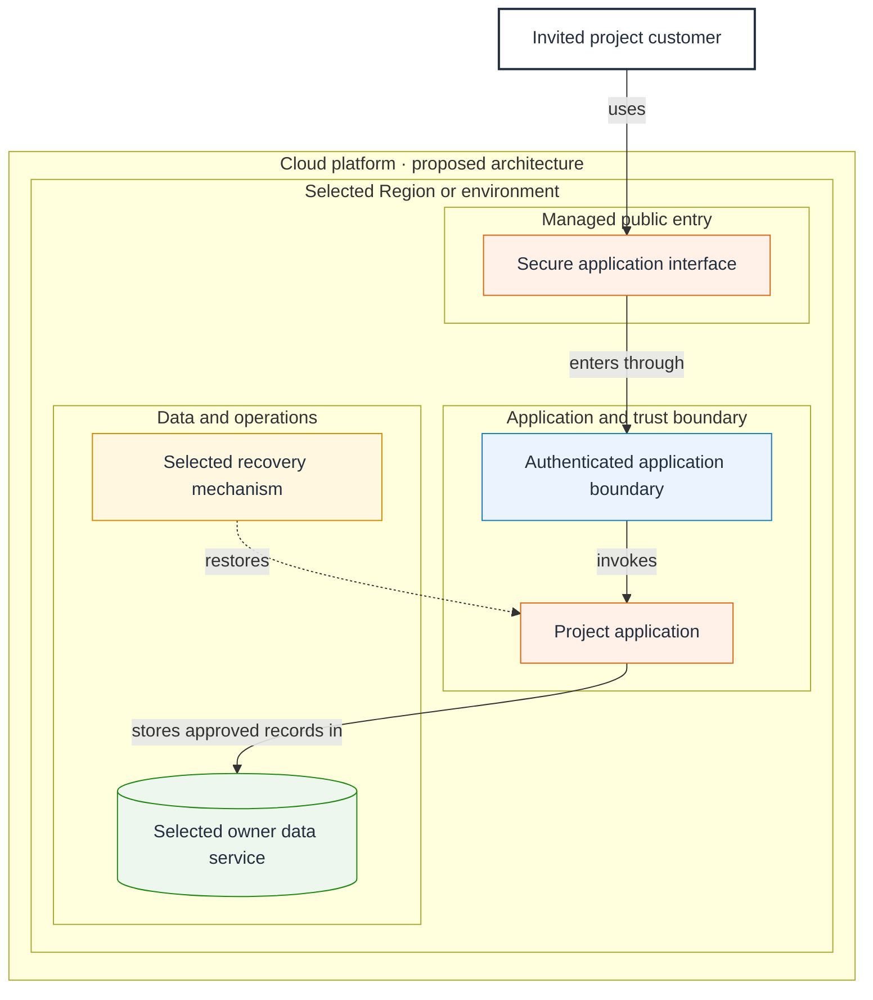
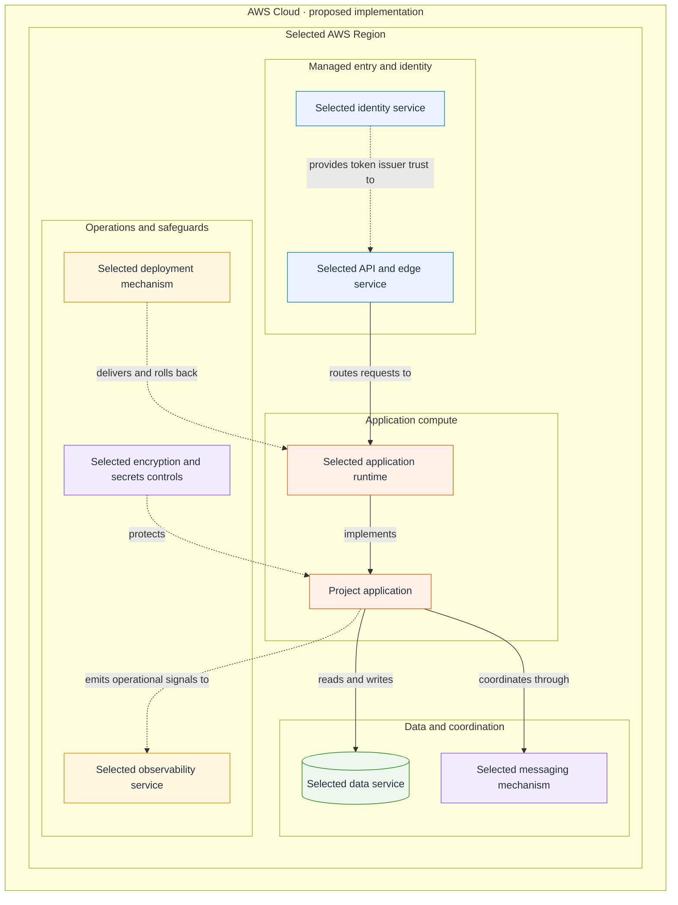
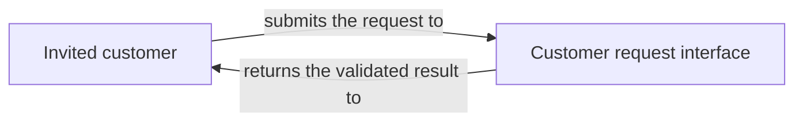
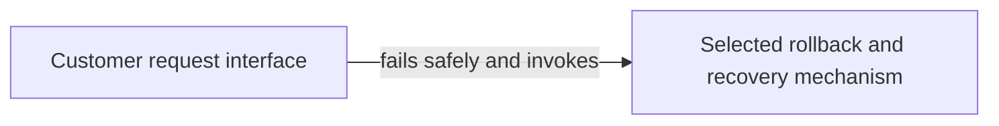

# Project diagram patterns

Load only during Design when the Engine reports a required project diagram that
is not current. These are syntax and presentation patterns, not application architecture,
evidence, lifecycle state, or authority. Replace every example identifier and
label with current canonical PRD records. Remove unused nodes and paths.

## Composition rules

### Authority and purpose

- Use only current canonical requirements, architecture, interface, event, data, boundary, state, technology, and actor records.
- Bind every displayed node and relationship through the Project Diagram Contract. Never invent an element for visual symmetry.
- Give each diagram one owner question. Use focused views for data, failure, migration, journey, and state detail instead of combining several stories into one dense view.
- Diagrams describe planned design unless observed evidence explicitly establishes otherwise. They never prove implementation, testing, deployment, AWS access, spending, or authorization.
- This procedure grants no application write, AWS, deployment, publication, or GitHub authority.

### Professional layout

- Put external actors and systems outside the main system boundary. Express membership through containment, never an arrow labeled includes.
- Use no more than three boundary levels. Group peers by public entry, processing, automation, data, messaging, observability, cost, delivery, or recovery.
- Use a left-to-right flow only for a compact linear story. Use top-to-bottom flow for complete architecture, AWS implementation, branching, and component-rich views.
- Do not rely on a nested subgraph direction when its nodes connect outside that subgraph. Organize the parent direction, declaration order, and boundaries.
- Aim for 12–20 nodes in broad views and node labels near three short lines; confirm final readability in the rendered review. Keep relationship labels to one concise phrase.
- Use solid arrows for primary runtime and data flow. Use dashed arrows for trust, telemetry, control, planning, and optional relationships.
- Use comments to divide request, data, failure, and operations flows in Mermaid source.
- Use at most six semantic class styles. Assign color by meaning, keep fills light and text dark, and never rely on color alone.
- Avoid experimental Mermaid syntax, external icon packs, custom JavaScript, and renderer-specific layout hacks.

### Connect relationships to the actual component

- Every arrow starts at the canonical component producing the request, event, data, signal, or decision and ends at the canonical component receiving it.
- Show every participating service as an explicit hop: visitor to CloudFront to S3, or API Gateway to Lambda to DynamoDB.
- Never draw one arrow through, behind, or across a participating service box. End the incoming relationship at that service and begin the next relationship from it.
- A cloud, Region, environment, trust, or functional boundary is containment, not an endpoint, unless the canonical design explicitly defines that boundary as the target.
- Never connect to a subgraph title, empty container area, nearby component, or generic stack box when a specific receiving service is known.
- Dashed trust, telemetry, control, and planning relationships follow the same endpoint rule.
- If the correct source, destination, or intermediate hop is unknown, leave the relationship unresolved instead of guessing.

- Use the canonical ID only as the Mermaid node identifier. The quoted label names the real project element and never repeats the ID.
- Use `flowchart TB` for the complete architecture and AWS implementation views. Group layers in two or more labeled subgraphs and keep the main outcome path visually central.
- Give every relationship a short verb phrase. Put detail in focused diagrams rather than making the complete view unreadably wide or dense.
- Keep labels concise, avoid unexplained abbreviations, and add one `accTitle` and one `accDescr` that explain the diagram without relying on color or position.
- Render the result before Gate B. Correct crossed paths, uneven groups, crowded labels, and excessive detail while preserving the canonical endpoints and relationships.

## Complete architecture pattern

Use the section-14 view for the selected architecture, real actors, trust and
data boundaries, selected AWS capabilities, observability, and recovery.

## AWS implementation pattern

Use the section-20 table to retain all eight validated AWS concerns. Show only
applicable selected services and mechanisms in the diagram; do not reproduce an AWS catalog or draw a non-applicable path.

## Focused views

- `PRIMARY_OUTCOME` shows the shortest approved end-to-end owner outcome.
- `JOURNEY` shows material actors, alternate paths, and rich-use-case behavior.
- `STATE` shows declared product states and valid transitions.
- `DATA_LIFECYCLE` shows ownership, retention, deletion, backup, and recovery movement.
- `FAILURE_RECOVERY` shows the material failure, bounded retry, rollback, and recovery path.
- `MIGRATION` shows the preserved source, bounded transition, validation point, and rollback target.

Every focused view follows the same human-label, relationship-label,
accessibility, and rendered-review rules. Never imply that a planned diagram was
deployed or observed. Moving an unchanged Mermaid block preserves its semantic
and presentation-source digests. Changing labels or group names updates the
presentation fingerprint without changing the architecture. Moving components
across containment groups or changing endpoints, edge kinds, or relationships
is a semantic design change.
