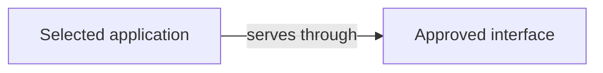
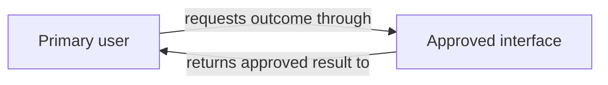
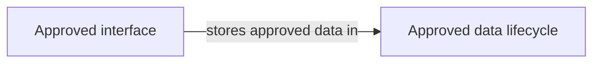
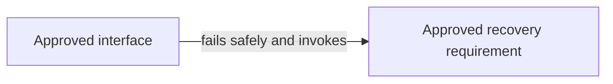

# Project diagram patterns

Load only during Design when the Engine reports a required project diagram that
is not current. These are syntax patterns, not application architecture,
evidence, lifecycle state, or authority. Replace every example identifier and
label with current canonical PRD records. Remove unused nodes and paths.

## System context pattern

Use a flowchart for the selected architecture, external actors, interfaces,
data boundaries, and material dependencies.

## Primary outcome pattern

Show the shortest approved end-to-end user outcome. Keep relationship labels in
plain language and bind every endpoint in the diagram contract.

## Data lifecycle pattern

Use only when current data, retention, deletion, or recovery records make the
view applicable.

## Failure and recovery pattern

Use only for current failure, asynchronous, rollback, or recovery behavior.

## Migration pattern

Use only for brownfield or migration work. Show the preserved source, bounded
transition, validation point, and rollback target with their canonical IDs.

Never imply that a planned diagram was deployed or observed. Mermaid rendering
changes do not redefine architecture; relationship or canonical-ID changes do.
