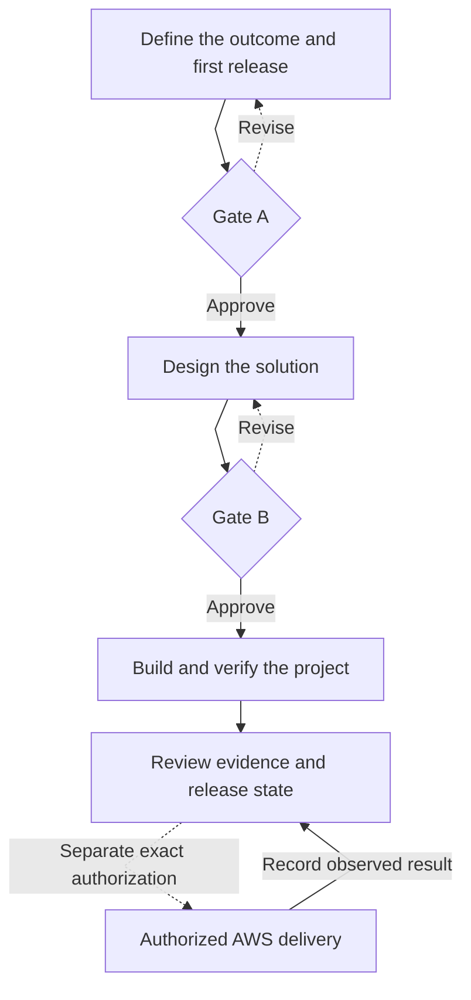

# AWS Codex Fastlane

> Spec-driven software and AWS delivery with Codex.

[](https://github.com/Levi-Breedlove/codex-aws-aidlc/releases/tag/v1.4.3)

[](LICENSE)

AWS Codex Fastlane is a spec-driven software and AWS delivery framework for Codex. It turns a product idea, an existing application, or an infrastructure change into a structured workflow: understand the problem, define requirements, design the solution, implement the work, verify the results, and prepare for release and authorized AWS operations.

Your requirements, architecture, decisions, tasks, and verification results stay together in the repository. Codex uses those records to understand what has been agreed, what is complete, what needs attention, and what should happen next—even when you reopen the project in a later session.

You approve two major decisions: the product requirements and the technical plan with its construction boundaries. Codex then carries out the approved work, tracks progress, runs the required checks, handles bounded corrections, and records the results. Publication and AWS operations follow their own explicit authorization steps.

Fastlane supports new applications, existing systems, infrastructure, features, repairs, refactors, and migrations. It keeps the intended product, implementation, and delivery evidence connected throughout the project.

**[Use this template →](https://github.com/Levi-Breedlove/codex-aws-aidlc/generate)**

## Quick start

Using GitHub Codespaces? Follow the [Codespaces walkthrough](docs/SETUP.md#github-codespaces) and its owner pilot checklist.

1. Complete the [one-time setup](docs/SETUP.md) for Codex and the official AWS Core plugin, create a repository with the button above, clone your generated repository, and open it in a signed-in interactive Codex CLI session.
2. Send this in the Codex conversation—not a shell:

   ```text
   init template
   ```

3. If Fastlane shows one consolidated checklist, complete it and send the same message again. Then provide the project name, one exact preferred AWS Region, and the development cost posture or hard cap. Reply `recommend one` for one explained Region option; it never chooses a default.

Fastlane initializes your project repository, presents **Project Ready**, and asks the first product question. Your development workspace can be on your computer or in GitHub Codespaces. Requirements, design, and repository construction need no AWS credentials; setup does not access an AWS account or deploy. An initialized project resumes without repeating setup.

## Why Fastlane is different

| Capability | What it does for your project |
|---|---|
| Guided product definition | Turns users, outcomes, constraints, and success criteria into a reviewable specification. |
| Architecture and diagrams | Compares designs and explains interfaces, security, data, recovery, and cost decisions. |
| Repository truth | Canonical project records—not chat memory—determine facts, progress, and the next permitted action. |
| Two owner gates | Gate A approves what should be built. Gate B approves the technical plan and bounded local construction. |
| Implementation and resume | Codex runs dependency-ready tasks within approved boundaries and preserves session checkpoints. |
| Honest evidence | Plans, source guidance, local checks, AWS observations, deployed behavior, and recovery exercises remain distinct. |
| AWS delivery | Covers account preflight, deployment, reconciliation, recovery, and teardown with exact owner authorization. |

The specification connects requirements, input boundaries, recovery promises,
design checks, task acceptance, and results. Ask Codex to explain the validation
plan and next action. Tests and owner review establish whether the implementation
satisfies the intended behavior.

The read-only Fastlane Engine evaluates repository state and fails closed when scope, evidence, approval, or authority is missing, stale, conflicting, or broader than recorded.

## Product lifecycle

Move from an agreed outcome to implementation, verification, and release review. AWS delivery follows separately authorized account operations and recorded results.



**Build never deploys.** Publication and AWS account work need separate authorization. **Local** means the development workspace, including a Codespace; the finished system can run elsewhere. Read the [complete workflow](docs/WORKFLOW.md) for each stage.

## Supported project work

| Project shape | Fastlane boundary |
|---|---|
| New application | Uses the approved greenfield design and reserves `app/**` as the single application source root. |
| Existing application | Records the brownfield baseline and preserves approved source roots, behavior, data, interfaces, and rollback boundaries. |
| Infrastructure-only work | Records that application source is not applicable and limits construction to the approved infrastructure boundary. |

Source-assisted Define can use an existing product brief as read-only input; the owner still confirms facts and approves both gates. Bounded features, repairs, refactors, migrations, and security changes follow the same truth and preservation rules.

## What the repository retains

| Durable record | What it contains |
|---|---|
| [PRD](docs/project/PRD.md) | Product Agreement, technical plan, architecture diagrams, Gate A, Gate B, and the local construction envelope |
| [Tasks](docs/project/TASKS.md) | Dependency-aware work, attempts, checkpoints, and resumable progress |
| [Verification](docs/project/VERIFY.md) | Attributable results, failures, stale evidence, and the exact limit of each claim |
| [Runbook](docs/project/RUNBOOK.md) | Project-specific validation, deployment, rollback, recovery, and teardown procedures—not proof that they ran |
| [Bugfix record](docs/project/BUGFIX.md) | One focused defect investigation when a bounded repair is active |

Readable owner briefs and summaries are projections of these records, not competing sources of truth. The planned diagram set is part of the PRD; an optional professional architecture board remains planned design, not implementation or deployment evidence.

## Trust and evidence boundary

- Only the owner accepts assumptions, approves Gate A or Gate B, and authorizes external actions.
- Codex is the sole project writer; challengers are read-only, and the Engine performs no AWS calls.
- AWS Core supplies current official guidance but cannot select owner intent, approve a gate, or authorize account access.
- Plugins, connectors, hooks, credentials, IAM capability, and passing checks are capabilities or evidence—not permission.
- A local pass never proves AWS behavior. A started AWS request never proves execution. Failed, partial, unknown, stale, and unobserved results remain visible.
- AWS claims require the applicable authorization and evidence observed from the named artifact and environment. Deployment never authorizes teardown.

See the [security policy](SECURITY.md) for reporting, credentials, privacy, hooks, and defense-in-depth boundaries.

## Documentation

- [Setup](docs/SETUP.md) — owner-run prerequisites and first initialization
- [Workflow](docs/WORKFLOW.md) — consultation, gates, diagrams, control plane, build, resume, and AWS boundaries
- [Project record guide](docs/project/README.md) — the durable project handoff
- [Troubleshooting](docs/TROUBLESHOOTING.md) — read-only diagnostics and safe recovery from blockers
- [Security](SECURITY.md) — trust, privacy, credentials, hooks, and vulnerability reporting
- [Latest release](https://github.com/Levi-Breedlove/codex-aws-aidlc/releases/latest) — exact package evidence and assets

Licensed under the [MIT License](LICENSE).
