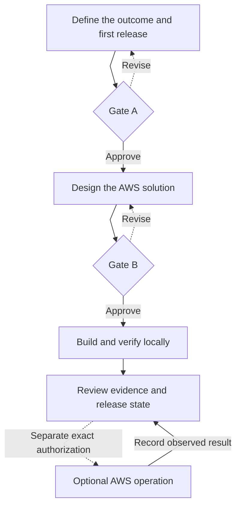

# AWS Codex Fastlane

> Owner-controlled AWS delivery for Codex.

[](https://github.com/Levi-Breedlove/codex-aws-aidlc/releases/tag/v1.4.1)

[](LICENSE)

AWS Codex Fastlane is an owner-controlled AWS delivery workflow for Codex. Built for developers delivering AWS software and infrastructure, it turns a product idea, existing application change, or infrastructure task into an evidence-backed local result while keeping project truth in the repository. You approve two decisions—what should be built and the technical boundary for local construction—then Codex plans, edits, tests, and records what it actually observed. AWS account reads, deployments, recovery actions, and teardown stay separate, exact, owner-authorized operations; credentials and the two gates never count as AWS permission.

**[Use this template →](https://github.com/Levi-Breedlove/codex-aws-aidlc/generate)**

## Quick start

1. Complete the [one-time setup](docs/SETUP.md) for Codex and the official AWS Core plugin, create a repository with the button above, clone your generated repository, and open it in a signed-in interactive Codex CLI session.
2. Send this in the Codex conversation—not a shell:

   ```text
   init template
   ```

3. If Fastlane shows one consolidated checklist, complete it and send the same message again. Then provide the project name, one exact preferred AWS Region, and the development cost posture or hard cap. Reply `recommend one` for one explained Region option; it never chooses a default.

Fastlane initializes the repository locally, presents **Project Ready**, and asks the first product question. No AWS credentials are needed for requirements, design, or local construction. Setup does not inspect credentials, access an AWS account, deploy, or authorize an AWS operation. An initialized project resumes without repeating setup.

## Why Fastlane is different

| Product boundary | What it changes |
|---|---|
| Repository truth | Canonical project records—not chat memory—determine facts, progress, and the next permitted action. |
| Two owner gates | Gate A approves what should be built. Gate B approves the technical plan and bounded local construction. |
| Bounded construction | After Gate B, Codex works only inside the recorded paths, commands, tasks, and attempt limits. |
| Honest evidence | Plans, source guidance, local checks, AWS observations, deployed behavior, and recovery exercises remain distinct. |
| Separate AWS authority | Every account read, mutation, and teardown needs its own exact, current owner authorization. Credentials are never authorization. |

The specification connects requirements to concrete accepted and rejected
inputs, data-recovery promises, design checks, task acceptance, and recorded
results. Ask Codex to explain the current validation plan to see the exact
commands, limits, evidence destinations, and next action. These links help
expose gaps; meaningful tests and owner review still determine whether the
implementation satisfies the intended behavior.

The read-only Fastlane Engine evaluates repository state and fails closed when scope, evidence, approval, or authority is missing, stale, conflicting, or broader than recorded.

## Product lifecycle

Two owner gates release local work. Optional AWS operations stay on a separate, explicitly authorized path.



**Build never deploys.** Gate A and Gate B do not authorize GitHub publication or AWS account work. Read the [complete workflow](docs/WORKFLOW.md) for corrections, resume behavior, architecture diagrams, and optional AWS stages.

## Supported project work

| Project shape | Fastlane boundary |
|---|---|
| New AWS application | Uses the approved greenfield design and reserves `app/**` as the single application source root. |
| Existing application | Records the brownfield baseline and preserves approved source roots, behavior, data, interfaces, and rollback boundaries. |
| Infrastructure-only work | Records that application source is not applicable and limits construction to the approved infrastructure boundary. |

Source-assisted Define can use an existing product brief as read-only input; the owner still confirms facts and approves both gates. Bounded features, repairs, refactors, migrations, and security changes follow the same truth and preservation rules.

## What the repository retains

| Durable record | What it contains |
|---|---|
| [PRD](docs/project/PRD.md) | Product Agreement, technical plan, architecture diagrams, Gate A, Gate B, and the local construction envelope |
| [Tasks](docs/project/TASKS.md) | Dependency-aware work, attempts, checkpoints, and resumable progress |
| [Verification](docs/project/VERIFY.md) | Attributable results, failures, stale evidence, and the exact limit of each claim |
| [Runbook](docs/project/RUNBOOK.md) | Project-specific validation, deployment, rollback, recovery, and teardown procedures—not proof that they ran |
| [Bugfix record](docs/project/BUGFIX.md) | One focused defect investigation when a bounded repair is active |

Readable owner briefs and summaries are projections of these records, not competing sources of truth. The planned diagram set is part of the PRD; an optional professional architecture board remains planned design, not implementation or deployment evidence.

## Trust and evidence boundary

- Only the owner accepts assumptions, approves Gate A or Gate B, and authorizes external actions.
- Codex is the sole project writer; challengers are read-only, and the Engine performs no AWS calls.
- AWS Core supplies current official guidance but cannot select owner intent, approve a gate, or authorize account access.
- Plugins, connectors, hooks, credentials, IAM capability, and passing checks are capabilities or evidence—not permission.
- A local pass never proves AWS behavior. A started AWS request never proves execution. Failed, partial, unknown, stale, and unobserved results remain visible.
- AWS claims require the applicable authorization and evidence observed from the named artifact and environment. Deployment never authorizes teardown.

See the [security policy](SECURITY.md) for reporting, credentials, privacy, hooks, and defense-in-depth boundaries.

## Documentation

- [Setup](docs/SETUP.md) — owner-run prerequisites and first initialization
- [Workflow](docs/WORKFLOW.md) — consultation, gates, diagrams, control plane, build, resume, and AWS boundaries
- [Project record guide](docs/project/README.md) — the durable project handoff
- [Troubleshooting](docs/TROUBLESHOOTING.md) — read-only diagnostics and safe recovery from blockers
- [Security](SECURITY.md) — trust, privacy, credentials, hooks, and vulnerability reporting
- [Latest release](https://github.com/Levi-Breedlove/codex-aws-aidlc/releases/latest) — exact package evidence and assets

Licensed under the [MIT License](LICENSE).
