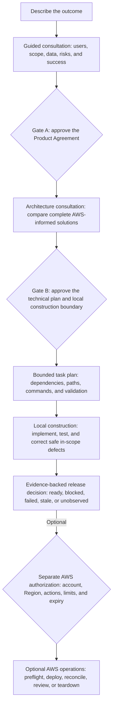
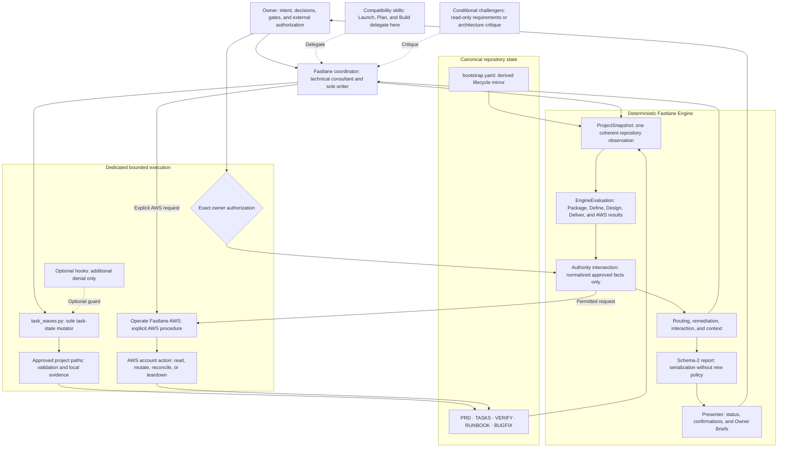

# Fastlane

> Canonical state, bounded autonomy, and evidence-backed AWS delivery for Codex.

[](https://github.com/Levi-Breedlove/codex-aws-aidlc/actions/workflows/ci.yml)
[](https://www.python.org/)
[](LICENSE)

Current customer build: **1.2.26**.

Fastlane is a repository-native governance platform that turns Codex into a
bounded technical consultant, AWS architecture guide, implementation agent, and
verifier.

You describe the outcome. Fastlane guides the product decisions, Codex compares
complete technical solutions using current AWS guidance, and you approve two
meaningful boundaries. Codex may then build and validate locally inside the
approved envelope. AWS account reads, deployments, and teardown remain separate,
exactly authorized actions.

Fastlane does not rely on chat history as project authority. It observes the
repository once, evaluates canonical records deterministically, derives the
current route and permitted scope, and reports only what the evidence supports.

**Observe once → evaluate deterministically → intersect authority → execute
through dedicated mutators → record evidence → explain the current truth.**

## Why Fastlane

AI can write code quickly. Delivering the right system safely requires more than
confident output. Fastlane binds decisions, execution, and claims to
version-controlled records and deterministic contracts.

| Delivery challenge | Fastlane response |
|---|---|
| Important decisions disappear into chat | Canonical records preserve requirements, design, tasks, evidence, and operations. |
| Agent autonomy has an unclear boundary | Two owner gates establish what to build and the exact local construction envelope. |
| Cloud recommendations become service lists | Codex compares complete solutions using current AWS Core guidance and project constraints. |
| Plans are mistaken for proof | Every claim keeps its actual maturity: confirmed, source verified, locally observed, AWS observed, failed, stale, or unobserved. |
| Credentials are mistaken for permission | AWS reads, mutations, and teardown require separate, exact owner authorization. |

Fastlane gives Codex room to work while making the limits of that work explicit,
inspectable, resumable, and deterministic.

## Customer delivery lifecycle

This is the path an owner experiences. The two gates approve product and
technical boundaries; neither gate authorizes an AWS account action.



Gate A approves the Product Agreement. Gate B approves the technical plan and a
bounded local construction envelope. After each approval, Codex continues until
another genuine owner decision or protected boundary is reached.

## What Fastlane gives you

- **Guided product consultation** with one consequential question at a time.
- **A canonical Product Agreement** with scope, risks, constraints, and
  measurable acceptance.
- **An AWS-informed architecture comparison** based on complete solutions,
  attributable guidance, and project constraints.
- **A Technical Owner Brief** explaining material decisions and the exact local
  construction boundary.
- **Bounded autonomous construction** with approved tasks, paths, commands,
  checkpoints, and safe in-scope correction.
- **Evidence-backed status** that distinguishes plans and approvals from local
  observations, AWS observations, failures, stale evidence, and unknowns.

Fastlane supports greenfield, brownfield, and infrastructure-only projects.
Delivery profiles change consultation depth—not the gates, evidence standards,
or authority safeguards.

## Start in minutes

1. Select [Use this template](https://github.com/Levi-Breedlove/codex-aws-aidlc/generate)
   and clone your new repository.
2. Follow the [setup guide](docs/SETUP.md) to install Codex, platform sandbox
   support, `uv` through `pipx`, and the official AWS Core plugin; then sign
   in and verify the integration.
3. Open the repository in a signed-in interactive Codex CLI session and send:

   ```text
   init template
   ```

4. Provide the project name, preferred AWS Region, and development budget once.
   Fastlane then asks one consequential product question at a time.

Initialization is credential-free. It does not inspect AWS credentials or access
an AWS account. Missing prerequisites appear in one consolidated checklist; see
[Troubleshooting](docs/TROUBLESHOOTING.md) if setup pauses.

No AWS credentials are needed for requirements, design, or local construction.

## How Fastlane works under the hood

Fastlane separates project meaning, observation, evaluation, authority,
execution, and presentation. One coordinator works from one observed repository
state; dedicated mutators perform only the actions that evaluated state permits.



The control plane has six deliberate boundaries:

1. **Canonical state:** project truth has one authoritative repository home.
2. **One coherent observation:** an immutable `ProjectSnapshot` captures the
   current repository facts and one evaluation time.
3. **Deterministic evaluation:** domain results compose into one immutable
   `EngineEvaluation`.
4. **Authority by intersection:** missing, stale, conflicting, expired, or
   broader input fails closed.
5. **Dedicated mutation paths:** the Engine evaluates; task and AWS actions use
   separate bounded procedures.
6. **Evidence-backed presentation:** the report serializes evaluated state and
   the presenter explains it without changing policy or authority.

Codex may vary an explanation's wording. It may not vary the evaluated decision,
evidence maturity, authority boundary, or required owner action.

## Skills and agents

Fastlane is not a swarm of equal writers. It has one adopter coordinator,
compatibility entry points, explicit specialist procedures, and two optional
read-only critics.

| Component | Role | State-changing? | Authority boundary |
|---|---|---|---|
| **Fastlane** | Main adopter coordinator and sole writer | Through approved mutators | Cannot self-approve or exceed Engine authority |
| **Launch, Plan, and Build Fastlane** | Compatibility aliases | No independent writes | Delegate to Fastlane |
| **Explain Fastlane** | Read-only teaching and state explanation | No | Restores the pending action |
| **Operate Fastlane AWS** | Explicit account-operation procedure | Only after exact authorization | Bound by Engine authority and the current receipt |
| **Maintain Fastlane** | Separate framework maintenance lifecycle | Under explicit maintenance scope | Never enters adopter delivery |
| **Requirements and architecture challengers** | Conditional read-only critique | No | Cannot write, approve, authorize, or operate |
| **AWS Core** | Current AWS expertise and procedures | Only through an authorized operation | Never grants Fastlane authority |
| **Optional hooks** | Additional request-boundary enforcement | May deny a request | Cannot create project state or permission |

## Canonical state and semantic anchors

Fastlane keeps project truth in ordinary Markdown:

| Record | What it owns |
|---|---|
| [`PRD.md`](docs/project/PRD.md) | Requirements, technical design, both gates, diagrams, and construction envelope |
| [`TASKS.md`](docs/project/TASKS.md) | Work, task boundaries, attempts, progress, and checkpoints |
| [`VERIFY.md`](docs/project/VERIFY.md) | Evidence maturity, observed results, gaps, AWS journals, and release decision |
| [`RUNBOOK.md`](docs/project/RUNBOOK.md) | Deployment, verification, rollback, recovery, and teardown procedures |
| [`BUGFIX.md`](docs/project/BUGFIX.md) | The current bounded defect when a repair is active |

```text
owner need → requirement → acceptance criterion → architecture decision
           → task → validation evidence → release claim
```

Stable IDs, revisions, source locations, receipts, and digests make change
impact explicit. Human-readable summaries and Owner Briefs are derived views;
they never replace, approve, or authorize the canonical records.

## AWS architecture and operational evidence

Fastlane compares complete system designs across security, reliability,
performance, cost, sustainability, and operational concerns. When a current AWS
fact is material, AWS Core supplies attributable guidance. Codex applies that
evidence; AWS Core does not select the architecture, approve a gate, or
authorize an account action.

Fastlane incorporates AWS Well-Architected concerns into requirements,
architecture, validation, and evidence. It does not claim an official AWS
Well-Architected Review, deployment, rollback, recovery, or teardown unless that
activity was separately performed and observed.

## Trust model and maturity

- Exactly two routine owner gates; Gate B authorizes local construction only.
- Credentials, connectors, IAM access, and tool availability never equal
  authority.
- AWS reads, deployments, reconciliation, and teardown retain separate exact
  boundaries.
- Hooks are optional, disabled by default, and never become the authority source.
- Plans, approvals, guidance, local observations, and AWS observations remain
  distinct.

Fastlane is contract-validated and ready for controlled adopter testing.
Deterministic lifecycle behavior, receipts, task contracts, cross-platform
packaging, and synthetic journeys are tested. Independent customer
comprehension and specific AWS execution lanes require separately observed
evidence.

## Explore Fastlane

- [Set up Fastlane](docs/SETUP.md)
- [Understand the complete workflow](docs/WORKFLOW.md)
- [Browse the documentation](docs/README.md)
- [Review the security model](SECURITY.md)
- [Understand optional hooks](.codex/hooks/README.md)
- [Open the project record guide](docs/project/README.md)

Fastlane is released under the [MIT License](LICENSE).
