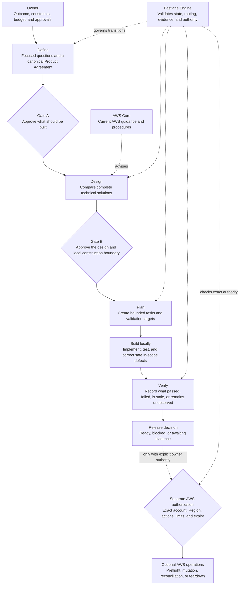

# Fastlane

> Governed AI delivery for AWS applications.

[](https://github.com/Levi-Breedlove/codex-aws-aidlc/actions/workflows/ci.yml)
[](https://www.python.org/)
[](LICENSE)

Current customer build: **1.2.25**.

Fastlane is a repository-native governance platform for Codex-assisted AWS
application delivery. It turns a product idea or existing codebase into approved
requirements, an AWS-informed technical plan, a bounded local build, and an
evidence-backed release decision.

Codex remains the technical consultant, coordinator, builder, and tester. You
retain control of product decisions, approvals, and every external action. The
Fastlane Engine keeps scope, evidence, routing, and authority consistent even when
the conversation changes or work resumes later.

## Why Fastlane

AI can write code quickly. Delivering the right system safely requires more than
code generation.

| Delivery challenge | Fastlane response |
|---|---|
| Important decisions disappear into chat | Canonical project records preserve requirements, design, tasks, evidence, and operations. |
| Agent autonomy has an unclear boundary | Two owner gates establish what to build and the exact local construction envelope. |
| Cloud recommendations become service lists | Codex compares complete solutions using current AWS Core guidance and project constraints. |
| Plans are mistaken for proof | Every claim is labeled by its actual maturity: confirmed, source verified, locally observed, AWS observed, failed, stale, or unobserved. |
| Credentials are mistaken for permission | AWS reads, mutations, and teardown require separate, exact owner authorization. |

Fastlane gives Codex room to work while making the limits of that work explicit,
inspectable, and deterministic.

## How Fastlane governs delivery



Gate A approves the Product Agreement. Gate B approves the technical plan and a
bounded local construction envelope. Neither gate authorizes AWS access,
deployment, spending, rollback, or teardown.

## One platform, four clear roles

| Participant | Responsibility | Cannot do |
|---|---|---|
| **Owner** | Supplies outcomes, constraints, budget, decisions, approvals, and exact external authority. | Delegate accountability to a credential, connector, or AI-generated statement. |
| **Codex** | Consults, recommends, coordinates, writes, builds, tests, and records evidence. | Approve its own work or broaden an authorized boundary. |
| **Fastlane Engine** | Validates canonical state and derives readiness, routing, staleness, evidence maturity, and authority. | Invent project facts, grant authority, or operate AWS. |
| **AWS Core** | Provides current AWS knowledge and procedures for material cloud decisions. | Select the architecture, approve a gate, or authorize an account action. |

## What Fastlane governs

- **Product intent:** users, outcomes, scope, non-goals, risks, constraints, and
  measurable acceptance.
- **Technical decisions:** complete architecture options, tradeoffs, security,
  reliability, recovery, cost, and current AWS evidence.
- **Construction:** one approved application source disposition, bounded tasks,
  allowed paths and commands, checkpoints, and local verification.
- **Claims:** a durable distinction between planned, confirmed, source-verified,
  locally observed, AWS-observed, failed, stale, and still unobserved work.
- **External authority:** exact, time-bounded permission for GitHub actions and
  each AWS read, mutation, reconciliation, or teardown step.

Fastlane supports greenfield applications, brownfield repositories, and
infrastructure-only projects. A delivery profile changes consultation depth—not
the two gates, evidence standards, or authority safeguards.

## Start in minutes

1. Select [Use this template](https://github.com/Levi-Breedlove/codex-aws-aidlc/generate)
   and clone your new repository.
2. Follow the [setup guide](docs/SETUP.md) to install Codex, platform sandbox
   support, `uv` through `pipx`, and the official AWS Core plugin; then sign in
   and verify the integration.
3. Open the repository in a signed-in interactive Codex CLI session and send:

   ```text
   init template
   ```

4. Provide the project name, preferred AWS Region, and development budget once.
   Fastlane then asks one consequential product question at a time.

Initialization is credential-free. It does not inspect AWS credentials or access
an AWS account. Missing prerequisites appear in one consolidated checklist; see
[Troubleshooting](docs/TROUBLESHOOTING.md) if setup pauses.

## Durable project records

Fastlane keeps project truth in ordinary Markdown so owners and engineers can
inspect it without a separate dashboard.

| Record | What it owns |
|---|---|
| [`docs/project/PRD.md`](docs/project/PRD.md) | Product Agreement, technical plan, Gate A, Gate B, diagrams, and construction envelope. |
| [`docs/project/TASKS.md`](docs/project/TASKS.md) | Current work, task boundaries, progress, and checkpoints. |
| [`docs/project/VERIFY.md`](docs/project/VERIFY.md) | Evidence maturity, observed results, failures, gaps, and release decision. |
| [`docs/project/RUNBOOK.md`](docs/project/RUNBOOK.md) | Repeatable deployment, verification, rollback, recovery, and teardown procedures. |
| [`docs/project/BUGFIX.md`](docs/project/BUGFIX.md) | The current bounded defect contract when a repair is active. |

Human-readable summaries and Owner Briefs are derived views. They make decisions
easier to review but never replace or authorize the canonical records.

## Trust boundaries

- Exactly two routine owner gates; no hidden approval step.
- No AWS credentials are needed for requirements, design, or local construction.
- Connector availability, credentials, IAM access, and Gate B never equal
  authorization.
- Hooks are optional, disabled by default, and never become the authority source.
- Safe in-scope corrections may continue automatically; owner decisions and
  external actions cannot.
- Fastlane reports observed evidence honestly and does not turn plans into proof.

## Explore Fastlane

- [Set up Fastlane](docs/SETUP.md)
- [Understand the complete workflow](docs/WORKFLOW.md)
- [Browse the documentation](docs/README.md)
- [Review the security model](SECURITY.md)
- [Understand optional hooks](.codex/hooks/README.md)
- [Open the project record guide](docs/project/README.md)

Fastlane is released under the [MIT License](LICENSE).
