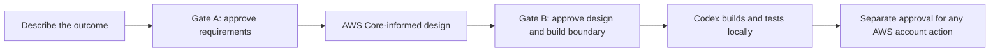

# AWS Codex Fastlane 1.2

Current customer build: **1.2.13**.

Fastlane turns an AWS application idea into an approved product agreement, an AWS-informed
technical plan, and a tested local build. You describe the outcome in plain language; Codex
asks focused questions and the Fastlane Engine keeps decisions, evidence, and authority aligned.

- **You set the destination:** outcome, constraints, budget, and approvals.
- **Codex pilots:** it asks, recommends, writes, tests, and records evidence.
- **AWS Core advises:** it supplies current AWS knowledge and procedures.
- **Fastlane governs:** it preserves boundaries and honest claims.

## What to expect



Gate A — approve requirements → Gate B — approve the PRD and construction boundary → Codex builds autonomously inside that boundary.

After the three one-time settings, Fastlane asks one short question at a time.
It creates tasks, builds locally, and continues until needed. Neither gate authorizes AWS deployment, spending, or teardown.

## Start

1. Select [Use this template](https://github.com/Levi-Breedlove/codex-aws-aidlc/generate)
   and clone the new repository.
2. Open it in a signed-in interactive Codex CLI and send:

   ```text
   init template
   ```

3. Fastlane checks Codex, Git, Python 3.11+, sandbox support, `uvx`, and AWS
   Core. Missing items appear in one consolidated checklist.
4. Answer project name, preferred AWS Region, and development budget—or say
   “minimize cost; no hard cap.”

Setup does not inspect AWS credentials or access an AWS account. See the
[setup walkthrough](docs/SETUP.md) and [troubleshooting guide](docs/TROUBLESHOOTING.md).

## AWS Core and AWS changes

Fastlane requires the official AWS Core plugin from the current AWS Agent Toolkit source
`aws-core@agent-toolkit-for-aws` in `aws/agent-toolkit-for-aws`; it does not pin a plugin version or commit. Codex discovers
only the runtime skills relevant to the current decision and does not copy AWS skills into the
repository. Ordinary requirements and
design need no AWS credentials or AWS account.

Codex chooses the architecture. AWS Core supplies current expertise; it cannot approve or authorize.
Fastlane evaluates secure pay-per-use serverless options and the lowest practical total cost without weakening required safeguards.

After Gate B, Codex builds locally. For AWS preflight, deployment verification, or teardown
preparation, ask Codex to use `$operate-fastlane-aws`. Fast Dev stays inside a current
non-production Gate B envelope; explicit-gate deployment and teardown require their own exact
receipts. Every AWS account operation still requires exact authorization for that action.

## Repository map

- `app/`: the one reserved greenfield application root.
- `infrastructure/`: infrastructure as code and deployment definitions.
- `tests/`: application and infrastructure verification.
- `docs/project/`: requirements, design, tasks, evidence, operations, and defects.

Start with the [documentation index](docs/README.md) or
[project record guide](docs/project/README.md).

## Learn more

- [Understand the workflow](docs/WORKFLOW.md)
- [Optional hooks](.codex/hooks/README.md)
- [Security](SECURITY.md)
