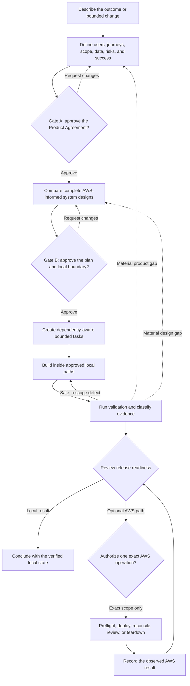

# Fastlane

> Governed Codex delivery for AWS software and infrastructure—from product intent to an evidence-backed local result.

[](https://www.python.org/)
[](LICENSE)

Current customer build: **1.3.2** · [Release](https://github.com/Levi-Breedlove/codex-aws-aidlc/releases/tag/v1.3.2) · [SHA-256 checksum](https://github.com/Levi-Breedlove/codex-aws-aidlc/releases/download/v1.3.2/aws-codex-fastlane-1.3.2.zip.sha256)

**Start here:** [Use this template](https://github.com/Levi-Breedlove/codex-aws-aidlc/generate) · [Setup](docs/SETUP.md) · [Understand the workflow](docs/WORKFLOW.md) · [Resume an initialized project](docs/WORKFLOW.md#build-resume-and-optional-hooks)

Fastlane is a repository-native governance platform that turns Codex into a technical guide, AWS architecture consultant, implementation partner, and evidence-driven verifier.

Bring an idea, an existing product brief, or a bounded change to an established system. Fastlane clarifies what should be built, explains important tradeoffs, and keeps decisions, approvals, work, and evidence in version-controlled project records. Codex can then build and validate locally inside the boundary you approved—without treating credentials or tool access as permission.

## Why teams use Fastlane

| Common problem | What Fastlane provides |
|---|---|
| Product decisions disappear into chat | Durable requirements, design decisions, tasks, and evidence in the repository |
| Cloud planning becomes a list of services | Complete architecture comparisons grounded in project needs and current AWS guidance |
| An agent's freedom is hard to understand | Two meaningful owner approvals and an exact local construction boundary |
| Existing planning is expensive to repeat | Source-assisted Define reuses a brief without importing its claims or approvals |
| A successful test is mistaken for production proof | Honest maturity labels for confirmed, verified, observed, failed, stale, and unobserved claims |
| Credentials are mistaken for authority | Separate, exact permission for AWS reads, deployment, and teardown |

## Where it fits

- **New AWS applications:** move from a rough idea to a complete, reviewable product and technical plan before code is built.
- **Existing applications:** protect current behavior, data, interfaces, and source locations while planning a feature or modernization.
- **Infrastructure-only work:** design and validate infrastructure without inventing an application source tree.
- **Existing product briefs:** use a prior PRD as non-authoritative source material, confirm what matters, and ask only about gaps or conflicts.
- **Bounded repairs:** reproduce a defect, constrain the repair, and retain regression evidence without reopening the whole project.

## Fastlane at a glance



This is the owner journey. The [complete lifecycle and technical control plane](docs/WORKFLOW.md#customer-delivery-lifecycle) show how canonical records, deterministic evaluation, bounded execution, and evidence feedback enforce these promises.

Gate A approves what should be built. Gate B approves the technical plan and exact local construction boundary. Neither gate authorizes AWS account access, spending, deployment, or teardown.

## What you receive

- A **Product Agreement** defining the outcome, users, first-release scope, non-goals, risks, constraints, and measurable success.
- A **Technical Owner Brief** explaining the complete recommended design, alternatives, tradeoffs, evidence maturity, and construction boundary.
- A **Complete Architecture Diagram** before Gate B, plus an optional professional planned AWS board after approval when its local output path was included in that boundary.
- A **Bounded Task Plan** that lets Codex continue through safe local work without requesting permission for every task.
- An **Evidence-Backed Release decision** stating what passed, failed, or has not yet been observed.
- An **Operations Plan** for deployment, verification, rollback, recovery, and teardown without implying that any account action is authorized.

## The important terms

| Term | Plain-language meaning |
|---|---|
| Gate A | Your approval of the Product Agreement—not architecture, construction, or AWS access |
| Gate B | Your approval of the technical plan and exact local build boundary—not deployment |
| Evidence maturity | The distinction between a plan, an approval, verified guidance, a local observation, and an AWS observation |

See how [canonical project records](docs/WORKFLOW.md#canonical-records-and-traceability), the [Fastlane Engine](docs/WORKFLOW.md#how-the-control-plane-works), and [AWS Core](docs/WORKFLOW.md#aws-core-and-aws-authority) keep project truth, routing, guidance, and authority separate.

<a name="start-in-minutes"></a>

## Quick start

1. Select [Use this template](https://github.com/Levi-Breedlove/codex-aws-aidlc/generate) and clone your new repository.
2. Follow the [setup guide](docs/SETUP.md) to install Codex, platform sandbox support, `uv` through `pipx`, and the official AWS Core plugin; then sign in and verify the integration.
3. Open the repository in a signed-in interactive Codex CLI session and send:

   ```text
   init template
   ```

4. Provide the project name, one exact preferred AWS Region, and development cost posture or hard cap once. If you reply `recommend one`, Fastlane explains one option and waits for your explicit Region confirmation; it never chooses a default. Fastlane then explains the consultation and asks one project question at a time.

Initialization is credential-free and never accesses an AWS account. Missing prerequisites appear in one consolidated checklist.

No AWS credentials are needed for requirements, design, or local construction.

## Trust by design

- One coordinator and one writer keep project state coherent.
- Exactly two routine owner gates preserve meaningful human control.
- Plans, approvals, source guidance, local evidence, and AWS observations never collapse into the same claim.
- Optional hooks may add a denial, but they cannot create permission.
- AWS reads, mutations, reconciliation, and teardown keep separate boundaries.
- Fastlane never claims deployment, rollback, recovery, or teardown without separately observed evidence.

Fastlane `1.3.2` is **`FRAMEWORK_RELEASE_QUALIFIED`** for the exact published package. It does not claim adopter-pilot results, AWS execution, deployment, rollback, recovery, teardown, or **`PRODUCT_FIELD_VALIDATED`**; each requires separate observed evidence.

## Go deeper

- [Understand the complete workflow and operating model](docs/WORKFLOW.md)
- [Set up Fastlane](docs/SETUP.md)
- [Browse the customer documentation](docs/README.md)
- [Review troubleshooting guidance](docs/TROUBLESHOOTING.md)
- [Review the security model](SECURITY.md)
- [Understand optional hooks](.codex/hooks/README.md)
- [Open the project record guide](docs/project/README.md)

Fastlane is released under the [MIT License](LICENSE).
