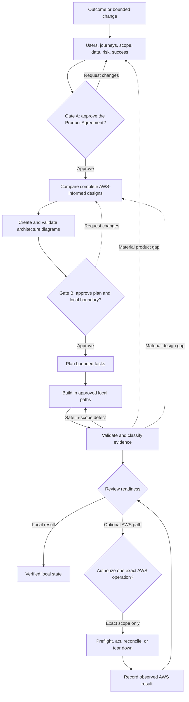
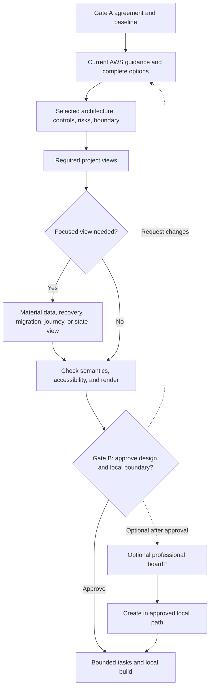

# Fastlane

> Governed Codex delivery for AWS software and infrastructure—from product intent to an evidence-backed local result.

[](https://www.python.org/)
[](LICENSE)

Current customer build: **1.3.3** · [Release](https://github.com/Levi-Breedlove/codex-aws-aidlc/releases/tag/v1.3.3) · [SHA-256 checksum](https://github.com/Levi-Breedlove/codex-aws-aidlc/releases/download/v1.3.3/aws-codex-fastlane-1.3.3.zip.sha256)

**Start here:** [Use this template](https://github.com/Levi-Breedlove/codex-aws-aidlc/generate) · [Setup](docs/SETUP.md) · [Understand the workflow](docs/WORKFLOW.md) · [Resume an initialized project](docs/WORKFLOW.md#build-resume-and-optional-hooks)

Fastlane is a repository-native governance platform that makes Codex an AWS architecture consultant, builder, and evidence-driven verifier. It turns an idea, brief, or bounded change into durable decisions, work, and evidence, then validates locally within the approved boundary. Tools and credentials never grant permission.

## Why teams use Fastlane

| Common problem | What Fastlane provides |
|---|---|
| Decisions disappear into chat | Repository records for requirements, design, tasks, and evidence |
| Cloud plans become service lists | Complete options grounded in the project and current AWS guidance |
| Agent freedom is unclear | Two owner approvals and an exact local construction boundary |
| Existing planning gets repeated | Source-assisted Define reuses a brief without importing claims or approvals |
| A test is mistaken for production proof | Honest confirmed, verified, observed, failed, stale, and unobserved labels |
| Credentials look like authority | Separate, exact permission for AWS reads, deployment, and teardown |

## Where it fits

- **New AWS applications:** approve an idea before construction.
- **Existing applications:** protect behavior, data, interfaces, and source paths.
- **Infrastructure-only work:** design without inventing an application tree.
- **Existing product briefs:** reuse a PRD while reconfirming its claims.
- **Bounded repairs:** constrain a defect fix and retain regression evidence.

## Fastlane at a glance



Gate A approves what should be built. Gate B approves the technical plan, project diagrams, and local construction boundary. Neither gate authorizes AWS account access, spending, deployment, or teardown. The [workflow guide](docs/WORKFLOW.md#customer-delivery-lifecycle) explains the control plane and evidence feedback.

## How architecture diagrams are created



Every project gets system-context, primary-outcome, and AWS-implementation views. Fastlane adds data-lifecycle, failure-and-recovery, migration, journey, or state views when material, validates Mermaid against the recorded design, and presents the set at Gate B. The optional board is a post-Gate-B presentation derivative in an approved local path. It is not a third gate and does not prove implementation, testing, deployment, AWS access, or AWS results. [See the operating detail](docs/WORKFLOW.md#architecture-diagrams-and-the-professional-board).

## What you receive

- A **Product Agreement** for outcome, users, scope, non-goals, risk, and success.
- A **Technical Owner Brief** for the design, alternatives, evidence, and local boundary.
- A **Project Diagram Set** for context, outcome, AWS implementation, and material focused views.
- An optional **Professional Architecture Board** after Gate B in an approved destination.
- A **Bounded Task Plan**, **Evidence-Backed Release** decision, and non-authorizing **Operations Plan**.

## The important terms

| Term | Plain-language meaning |
|---|---|
| Gate A | Product Agreement approval—not architecture, construction, or AWS access |
| Gate B | Technical plan, diagrams, and local build boundary—not deployment |
| Evidence maturity | Separates plans, approvals, verified guidance, local results, and AWS results |

See how [project records](docs/WORKFLOW.md#canonical-records-and-traceability), the [Fastlane Engine](docs/WORKFLOW.md#how-the-control-plane-works), and [AWS Core](docs/WORKFLOW.md#aws-core-and-aws-authority) separate truth, routing, guidance, and authority.

<a name="start-in-minutes"></a>

## Quick start

1. Select [Use this template](https://github.com/Levi-Breedlove/codex-aws-aidlc/generate) and clone your new repository.
2. Follow [setup](docs/SETUP.md) for Codex, sandbox support, `uv`, and the official AWS Core plugin; then sign in and verify it.
3. Open the repository in a signed-in interactive Codex CLI session and send:

   ```text
   init template
   ```

4. Provide the project name, one exact preferred AWS Region, and development cost posture or hard cap. Reply `recommend one` for an explained option; it never chooses a default. Fastlane then asks one project question at a time.

Initialization is credential-free and never accesses an AWS account. Missing prerequisites appear in one consolidated checklist. No AWS credentials are needed for requirements, design, or local construction. Diagram creation and validation are also local and credential-free.

## Trust by design

- One coordinator, one writer, and two owner gates preserve coherent state and human control.
- Plans, approvals, guidance, local evidence, and AWS observations remain distinct claims.
- Diagrams describe plans; hooks may deny, but neither creates permission.
- AWS reads, changes, reconciliation, and teardown require separate authority and evidence.

Fastlane `1.3.3` is **`FRAMEWORK_RELEASE_QUALIFIED`** for the exact published package. It does not claim adopter-pilot results, AWS execution, deployment, rollback, recovery, teardown, or **`PRODUCT_FIELD_VALIDATED`**; each requires separate observed evidence.

## Go deeper

- [Complete workflow](docs/WORKFLOW.md)
- [Setup](docs/SETUP.md)
- [Customer documentation](docs/README.md)
- [Troubleshooting](docs/TROUBLESHOOTING.md)
- [Security](SECURITY.md)
- [Optional hooks](.codex/hooks/README.md)
- [Project records](docs/project/README.md)

Fastlane is released under the [MIT License](LICENSE).
