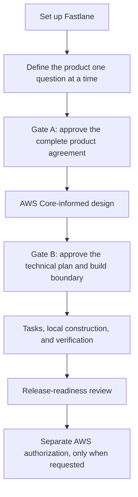

# Fastlane 1.2 qualification and walkthrough

This page shows what an owner experiences and what the 1.2 qualification
actually proves. It is a release-facing view of existing Fastlane contracts,
not a new gate, project record, or source of authority.

## Current result

| Question | Answer |
|---|---|
| What was exercised? | Credential-free repository contracts, synthetic owner journeys, deterministic packaging, and extracted-template startup |
| What was not exercised? | Independent adopter use, external model role-play, and real AWS operations |
| Does this authorize AWS access? | No |
| Does this authorize a tag or release? | No; publication remains a separate owner action |

## Owner journey

### 1. Start and prerequisites

Create a repository from the template, open it in an interactive Codex session,
and send `init template`. Fastlane explains what it does, checks the owner-run
prerequisites, and gives one consolidated setup action if Codex, Git, Python,
`uvx`, sandbox support, or the official AWS Core plugin is unavailable.

Setup is credential-free. It neither inspects AWS credentials nor accesses an
AWS account.

### 2. Supply the three one-time settings

The only multi-question setup turn asks for:

1. project name;
2. preferred AWS Region; and
3. development cost posture.

After setup, Fastlane asks exactly one owner question per turn. Each answer is
confirmed in plain language, including what it changes and a direct correction
phrase.

### 3. Review Gate A

The Gate A Owner Brief explains the complete product agreement: outcome, users,
first-release journey, scope, non-goals, data and access boundaries, deletion,
recovery, Region, cost, measurable acceptance, decision sources, claim status,
and unauthorized work. It links directly to the relevant canonical PRD
sections. The exact approval receipt is the final block.

If something is wrong, request a correction instead of approving. A receipt-only
approval response remains receipt-only.

### 4. Let Codex design with AWS Core

After Gate A, Codex continues automatically. For material AWS decisions,
Fastlane requires a current credential-free `search_documentation` call followed
by `retrieve_skill` for an identifier returned by that search. Cached prose,
memory, or a challenger cannot replace that evidence. Codex applies the current
guidance and recommends one coherent architecture; AWS Core does not approve it.

### 5. Review Gate B

The Gate B Technical Owner Brief Pack explains every Engine-marked decision:
architecture, application root, identity, authorization, data, AWS services,
security, reliability, cost, recovery, deployment, tests, and the construction
boundary. Each decision includes its requirement basis, alternatives,
tradeoffs, risks, evidence status, and measurable reconsideration trigger.

The brief links to the exact canonical PRD sections and keeps the exact Gate B
receipt last. After approval, Fastlane repeats the useful links, generates the
first task wave, and continues local construction without task-by-task approval.

### 6. Build locally and stop before AWS authority

Greenfield application code goes under `app/`, tests under `tests/`, and
infrastructure definitions under `infrastructure/`. Fastlane records observed
evidence, repairs safe Codex-owned defects within its bounds, restores the
pending action after side questions, and resumes without repeating setup.

Gate B permits only its local construction boundary. AWS preflight, mutation,
rollback, recovery, and teardown remain separately controlled and observed.

## Owner and AI qualification matrix

`DETERMINISTIC_PASS` means the credential-free repository test named by the
evidence reference passed for this release candidate. It does not mean an
independent adopter, external model, or AWS account performed the journey.

| ID | Owner-visible journey | Evidence | Result |
|---|---|---|---|
| QUAL-01 | Missing prerequisites produce one clear action and an AWS Core walkthrough | QTEST-01 | `DETERMINISTIC_PASS` |
| QUAL-02 | Initial setup asks exactly three project settings in one turn | QTEST-02 | `DETERMINISTIC_PASS` |
| QUAL-03 | Later intake asks exactly one owner question per turn | QTEST-03 | `DETERMINISTIC_PASS` |
| QUAL-04 | Recorded answers include their effect and a plain correction phrase | QTEST-04 | `DETERMINISTIC_PASS` |
| QUAL-05 | Gate A presents a complete linked Owner Brief and exact approval boundary | QTEST-05 | `DETERMINISTIC_PASS` |
| QUAL-06 | Valid Gate A approval continues automatically into design | QTEST-06 | `DETERMINISTIC_PASS` |
| QUAL-07 | Material design evidence links search to the exact retrieved AWS Core skill | QTEST-07 | `DETERMINISTIC_PASS` |
| QUAL-08 | Gate B renders every required technical decision and source | QTEST-08 | `DETERMINISTIC_PASS` |
| QUAL-09 | Valid Gate B approval continues to task generation and the first build wave | QTEST-09 | `DETERMINISTIC_PASS` |
| QUAL-10 | A side question answers directly and restores the pending action | QTEST-10 | `DETERMINISTIC_PASS` |
| QUAL-11 | Resume restores the initialized stage without repeating setup | QTEST-11 | `DETERMINISTIC_PASS` |
| QUAL-12 | Hooks-off and owner-enabled hooks preserve Engine authority | QTEST-12 | `DETERMINISTIC_PASS` |
| QUAL-13 | A safe Codex-owned defect is repaired before burdening the owner | QTEST-13 | `DETERMINISTIC_PASS` |
| QUAL-14 | Greenfield, infrastructure-only, and brownfield source layouts fail closed correctly | QTEST-14 | `DETERMINISTIC_PASS` |
| QUAL-15 | The deterministic package extracts, initializes, routes, and resumes | QTEST-15 | `DETERMINISTIC_PASS` |

Executable evidence references

- QTEST-01: `tests.test_conversation_contracts.ConversationContractTests.test_missing_prerequisites_return_one_complete_action_then_ready_welcome`
- QTEST-02: `tests.test_setup_assistant.SetupAssistantTests.test_ready_welcome_collects_three_values_once`
- QTEST-03: `tests.test_product_journeys.ProductJourneyTests.test_partial_high_risk_intake_remains_a_plain_owner_consultation`
- QTEST-04: `tests.test_owner_briefs.OwnerBriefProjectionTests.test_answer_confirmation_requires_matching_new_owner_response`
- QTEST-05: `tests.test_product_journeys.ProductJourneyTests.test_owner_briefs_and_diagrams_use_real_project_artifacts`
- QTEST-06: `tests.test_bootstrap_doctor.BootstrapDoctorTests.test_owner_input_creates_a_turn_boundary_but_automatic_work_does_not`
- QTEST-07: `tests.test_bootstrap_doctor.BootstrapDoctorTests.test_aws_core_runtime_discovery_chains_are_linked_and_ordered`
- QTEST-08: `tests.test_owner_briefs.OwnerBriefProjectionTests.test_gate_b_renders_every_human_decision_field_and_source`
- QTEST-09: `tests.test_conversation_contracts.ConversationContractTests.test_golden_define_design_deliver_route_has_only_two_product_stops`; `tests.test_task_waves.TaskWaveSafetyTests.test_new_build_walking_skeleton_is_the_only_first_wave`
- QTEST-10: `tests.test_conversation_contracts.ConversationContractTests.test_incomplete_intake_and_explanation_restore_one_plain_next_action`
- QTEST-11: `tests.test_conversation_contracts.ConversationContractTests.test_initialized_intake_resume_does_not_repeat_setup`
- QTEST-12: `tests.test_product_journeys.ProductJourneyTests.test_hook_preserves_documentation_and_distinct_aws_authority_lanes`
- QTEST-13: `tests.test_conversation_contracts.ConversationContractTests.test_mixed_diagnostics_repair_safe_codex_items_first`
- QTEST-14: `tests.test_bootstrap_doctor.BootstrapDoctorTests.test_greenfield_gate_b_binds_application_source_to_singular_app`
- QTEST-15: `tests.test_package_release.PackageReleaseTests.test_extracted_release_configures_in_place_and_passes_doctor`; `tests.test_product_journeys.ProductJourneyTests.test_extracted_template_setup_initializes_once_and_resumes`

## Release claim boundary

> Repository contracts, deterministic tests, and owner/AI journeys passed.
> Independent adopter evidence has not yet been collected.
> Real AWS deployment, rollback, recovery, and teardown remain unobserved
> unless separately field-qualified.

In that statement, **owner/AI journeys** means the credential-free synthetic
journeys exercised by deterministic repository tests. External model role-play:
`NOT_RUN`. No live model or independent-rater evidence is claimed.

| Claim class | Fastlane 1.2 status |
|---|---|
| Verified | Repository contracts, deterministic tests, package reproducibility, and synthetic owner-facing journeys after required branch-head checks pass |
| Planned | Independent adopter testing and separately authorized AWS field qualification |
| Unobserved | Adopter success and real AWS deployment, rollback, recovery, or teardown |
| Unauthorized by this qualification | AWS account access or mutation, tag or release publication, repository settings, and branch deletion |

## Where to inspect the canonical state

- [Project agreement and design](project/PRD.md)
- [Task progress](project/TASKS.md)
- [Verified and unobserved claims](project/VERIFY.md)
- [Operations and recovery boundaries](project/RUNBOOK.md)
- [Complete owner workflow](WORKFLOW.md)
- [Evaluation boundaries](EVALUATION.md)

The qualification page summarizes those contracts; it never replaces them.
