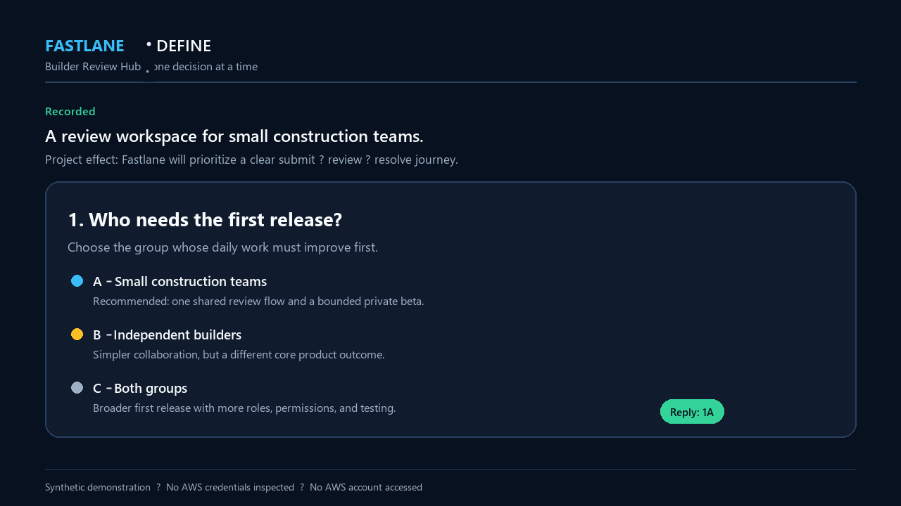
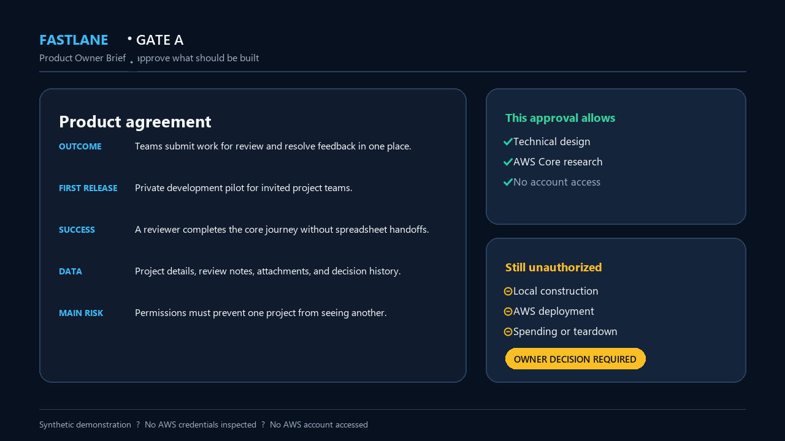
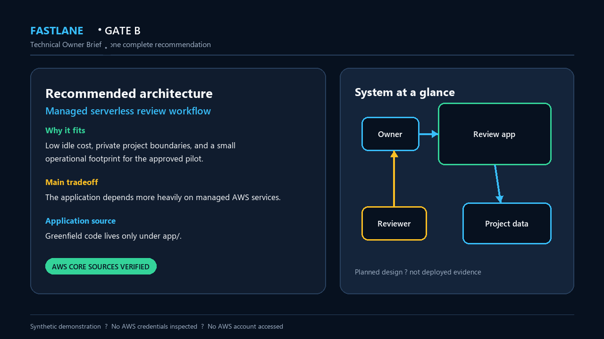
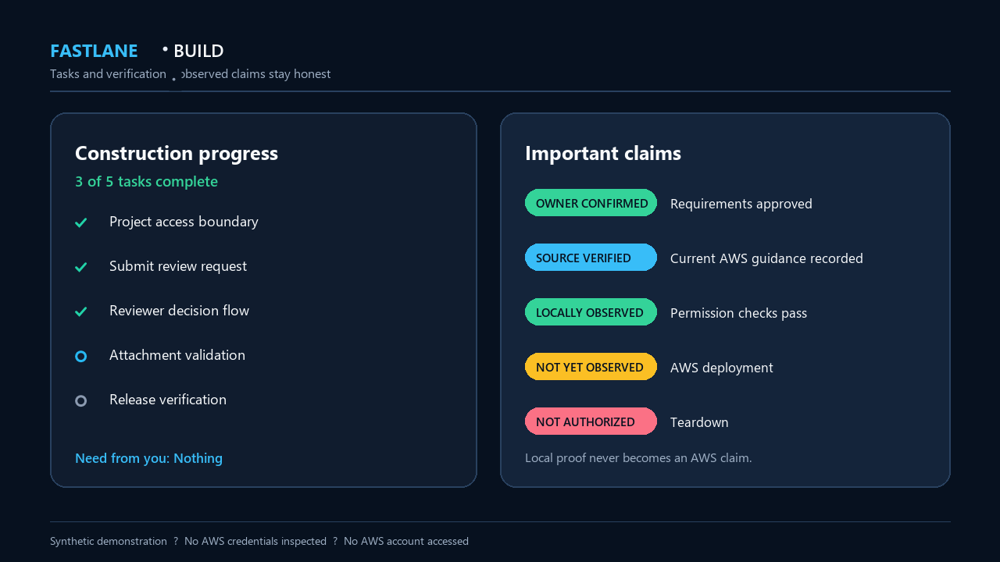

# Fastlane customer showcase

This synthetic “Builder Review Hub” journey shows how Fastlane feels to an
owner. It demonstrates conversation, project records, and local evidence only;
it does not represent a real AWS deployment or an independently observed user
study.

## 1. Start with the outcome

The owner supplies the three one-time settings, then Fastlane asks one focused
product question per turn. Each answer is confirmed before the next decision.

## 2. Approve the product agreement

Gate A presents the complete first-release outcome, users, scope, success,
data and access boundaries, risks, cost posture, and what remains unauthorized.
The owner can request a plain-language correction or provide the exact receipt.

## 3. Review one complete technical plan

Codex uses current AWS Core guidance, compares complete alternatives, and
recommends one architecture. Gate B explains the design, tradeoffs, diagrams,
construction limits, and application-source location. It still does not
authorize AWS account access.

## 4. Follow local construction and proof

After Gate B, Codex creates dependency-aware tasks, builds under the approved
source disposition, runs local checks, and separates observed results from
planned or unauthorized claims.

## What the demonstration proves

- The owner sees one current action and understandable consequences.
- Gate A and Gate B remain the only routine approval checkpoints.
- AWS Core advises the technical recommendation but grants no authority.
- The Fastlane Engine keeps project records, routing, and evidence consistent.
- Local proof never becomes a claim about unobserved AWS behavior.

## Evidence boundary

The tracked images contain only synthetic data. They contain no credentials,
account identifiers, private transcripts, local machine paths, or session
state. See the [qualification record](QUALIFICATION.md) for exact deterministic,
rendered-review, and role-play evidence boundaries.

The release-hosted walkthrough is published as
[`fastlane-1.2-demo.mp4`](https://github.com/Levi-Breedlove/aws-bootstrap/releases/latest/download/fastlane-1.2-demo.mp4)
with a separate SHA-256 file. Its availability is a release-publication action,
not a property of this source tree.
