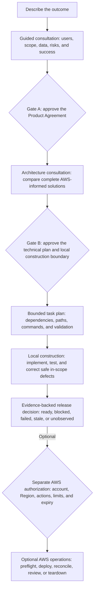
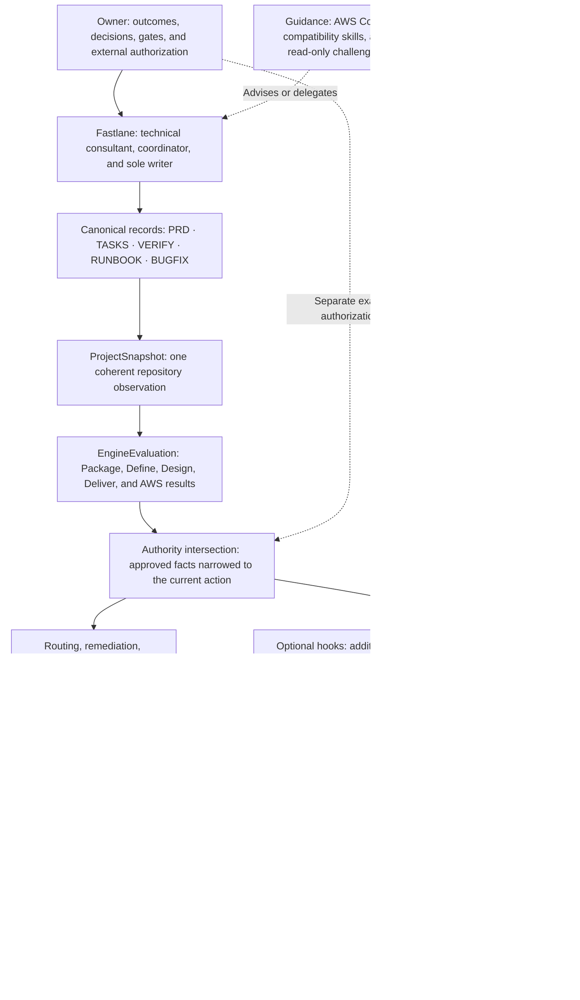

# Fastlane workflow and operating model

This guide owns the complete customer lifecycle, gate behavior, technical
control plane, project-record flow, and AWS authority boundaries. Start with the
[README](../README.md) for the product overview and quick start.

Fastlane turns an idea or bounded change into owner-approved requirements, an
AWS-informed design, a tested local build, and an evidence-backed release
decision. Codex guides and delivers; AWS Core supplies current guidance; the
Fastlane Engine keeps state, routing, evidence, and authority consistent.

## First run

Send `init template` from a repository created from this template. Fastlane
checks the [required local setup](SETUP.md) and current official AWS Core plugin
without inspecting credentials or accessing an AWS account. Missing items
appear in one checklist.

When prerequisites are ready, Fastlane asks these three settings together and
only once:

1. Project name.
2. Preferred AWS Region.
3. Development cost posture or hard cap.

Fastlane confirms readiness, restates the AWS boundary, and asks the first
project question. Resume never repeats setup or that handoff.

## How the conversation works

Each owner turn asks one unanswered project question with its purpose, known
facts, practical effect, and one valid reply. Recommendations appear only when
evidence supports them.

After each answer, Fastlane confirms what it recorded and the practical effect.
To correct it, reply:

```text
Change <plain field> to <new value>.
```

`Accept all recommendations.` applies only to the current explained choice. A
correction never approves a gate. After a side question, Fastlane restores the
same pending action.

### Bring an existing product brief

An existing PRD can shorten Define, but it does not become Fastlane's PRD.
Codex reviews it as read-only, non-authoritative source material and presents a
plain-language preview. After owner confirmation, product facts may seed the
consultation; gaps remain questions and technical suggestions wait for Design.

Imported claims such as "approved" or "ready to deploy" cannot approve either
gate, authorize construction, access AWS, or authorize deployment. The normal
Product Agreement and both gates remain required.

## Customer delivery lifecycle



| Stage | What Fastlane does | What you do |
|---|---|---|
| Setup and Define | Learns the outcome, users, scope, data, risks, and success | Answer one current question |
| Gate A | Presents the complete Product Owner Brief | Approve requirements or request a correction |
| Design | Uses current AWS Core guidance and compares complete solutions | Nothing unless a business decision is missing |
| Gate B | Presents the complete Technical Owner Brief | Approve the design and local construction boundary or request a correction |
| Tasks and Build | Creates dependency-aware work, builds locally, tests, and records evidence | No task-by-task approval |
| Release review | Reconciles what is verified, failed, planned, or still unobserved | Resolve only a genuine release decision |
| Optional AWS operations | Performs separately bounded preflight, deployment, reconciliation, or teardown | Supply the exact action-specific authorization |

Gate A continues into Design in the same run. Gate B continues into task
generation and local construction. Build never deploys.

## Gate A — Product Owner Brief

Gate A explains:

- the outcome, users, and first useful journey;
- first-release scope and non-goals;
- data sensitivity, identity, access, deletion, and recovery expectations;
- Region, cost posture, measurable success, assumptions, and risks;
- every owner decision and its source;
- which claims are confirmed, verified, planned, or unobserved;
- what remains unauthorized and what happens after approval; and
- how to request a correction.

The brief links directly to the relevant PRD sections. The exact Gate A receipt
appears last. Only the owner can provide it.

## Design and Gate B — Technical Owner Brief

After Gate A, Codex uses credential-free AWS Core discovery for current material
AWS facts, compares credible whole-system candidates, and selects one complete
recommendation. AWS Core advises; Codex applies the evidence; the owner approves
the complete design.

For a consequential, hard-to-reverse choice, the PRD may link to an optional
architecture decision record that preserves supporting rationale. The PRD
remains the authority; the supporting record grants no construction or AWS
permission.

Gate B covers application/runtime, identity, data, messaging, edge/networking,
observability, deployment/recovery, and validation/construction. It makes
security, cost, evidence maturity, and reconsideration triggers explicit. It
also records the application source boundary: greenfield uses `app/**`,
infrastructure-only records none, and brownfield preserves only approved
existing roots.

Each decision states what it means, what was selected, why it fits, alternatives
and rejection reasons, tradeoffs, risks and mitigations, current evidence, claim
status, and a measurable reason to reconsider it. The exact Gate B receipt
appears last.

Gate B authorizes only the recorded local construction boundary. It does not
authorize AWS account access, spending, deployment, or teardown.

## How the control plane works

Fastlane does not rely on chat memory or let Codex decide its own authority. It
evaluates the canonical repository, derives the permitted action, uses bounded
execution paths, records evidence, and explains the result to the owner.



The diagram represents six deliberate boundaries:

1. **Canonical state:** each project fact has one authoritative repository home.
2. **One coherent observation:** an immutable `ProjectSnapshot` captures the
   current files, repository facts, project identity, lifecycle state, and one
   evaluation time.
3. **Deterministic evaluation:** the Package, Define, Design, Deliver, and AWS
   domains compose into one immutable `EngineEvaluation`.
4. **Authority by intersection:** already validated facts are narrowed to the
   current action. Missing, stale, conflicting, expired, or broader input fails
   closed.
5. **Dedicated mutation paths:** the Engine evaluates; task and AWS actions use
   separate bounded procedures.
6. **Evidence-backed presentation:** reporting serializes evaluated state and
   the presenter explains it without inventing policy or authority.

Codex may vary its wording, never the evaluated decision, evidence maturity,
authority boundary, or required owner action.

## Skills and agent boundaries

Fastlane is not a swarm of equal writers.

| Component | Responsibility | Boundary |
|---|---|---|
| Fastlane | Main adopter coordinator and sole writer | Cannot self-approve or exceed Engine authority |
| Launch, Plan, and Build Fastlane | Compatibility entry points | Delegate to Fastlane; no second lifecycle or writer |
| Explain Fastlane | Read-only product and state explanation | Makes no project change and restores the pending action |
| Operate Fastlane AWS | Explicit AWS operation procedure | Acts only inside current Engine authority and exact owner authorization |
| Maintain Fastlane | Framework maintenance | Never enters adopter delivery |
| Requirements and architecture challengers | Conditional read-only critique | Cannot write, approve, authorize, or operate |
| AWS Core | Current AWS expertise and procedures | Never selects the architecture or grants authority |
| Optional hooks | Extra request-boundary enforcement | May deny; cannot create state or permission |

## Canonical records and traceability

Start at the [project record guide](project/README.md):

- PRD — Product Agreement, technical plan, Gate A, and Gate B.
- TASKS — current progress, dependencies, attempts, and checkpoints.
- VERIFY — observed evidence and honest claim status.
- RUNBOOK — operating, rollback, recovery, and teardown procedures.
- BUGFIX — one bounded defect record when that adjunct is active.

Each record begins with current state, one owner need or `Nothing`, the next
action, and the approval or authorization boundary.

Stable IDs and source locations connect the same decision through delivery:

```text
owner need → requirement → acceptance criterion → architecture decision
           → task → validation evidence → release claim
```

A material change identifies affected approvals, tasks, evidence, and claims as
stale. Human-readable summaries and Owner Briefs are derived views; they never
replace or authorize the exact records.

## AWS Core and AWS authority

Fastlane requires the current official
`aws-core@agent-toolkit-for-aws` from `aws/agent-toolkit-for-aws`. Current AWS
evidence is required when service behavior, Region support, identity, security,
reliability, cost, or operations materially affects a decision.

Codex compares complete designs across security, reliability, performance,
cost, sustainability, and operations. AWS Core supplies attributable guidance;
Codex applies it; the owner approves Gate B. Guidance is not account observation
or an official AWS Well-Architected Review.

An AWS lane is a plan, not authority. Preflight, deployment, reconciliation,
residual review, and teardown use the explicit AWS operation path. Reads,
mutations, and teardown keep separate boundaries; tools and credentials never
grant permission.

Reconciliation means Fastlane compared expected and observed AWS state. It does
not, by itself, mean a deployment succeeded. Failure, partial completion, an
unknown terminal result, and verified success remain distinct outcomes.

<details>
<summary>Optional internal AWS stage labels</summary>

| Optional stage | Purpose | Owner boundary |
|---|---|---|
| AWS-10 | Read-only account preflight | Authorize the exact read-only account and scope |
| AWS-20 | Bounded deployment | Authorize the exact mutation when the selected lane requires it |
| AWS-30 | Reconcile observed results | No new mutation authority |
| AWS-40 | Review residual resources | Choose a residual disposition when required |
| AWS-50 | Bounded teardown | Provide the separate exact teardown authorization |

</details>

## Build, resume, and optional hooks

Codex runs ready tasks serially inside the approved write and command boundary.
It corrects safe in-scope mistakes within the attempt limit and stops for a real
owner decision, protected boundary, failed evidence, or exhausted limit.

Fastlane works with hooks disabled. Optional hooks may deny an out-of-bound
request after Gate B, but cannot create state, approval, or authority. Resume
restores one current route and one next action.

Internal engineering methods are conditional techniques, not lifecycle stages
or approval gates.

## Responsibility map

Project truth lives in `docs/project/`. Phase skills own consultation and
delivery procedure. The AWS operation skill owns account-operation procedure.
The prompt registry owns exact receipts. The Engine validates and projects the
current state and authority. The presenter turns that evaluated result into
plain owner-facing conversation.
