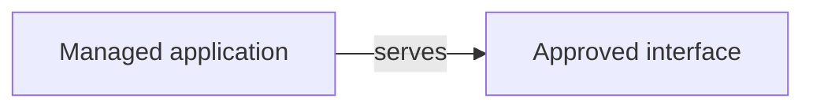
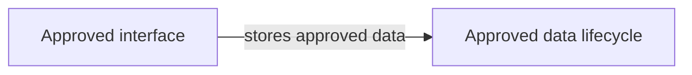
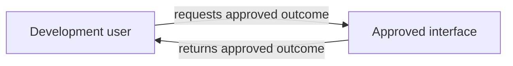
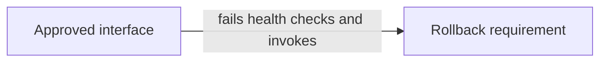

# {{PROJECT_NAME}} — Product Requirements and Technical Design

Canonical path: `docs/project/PRD.md`.
<!-- FASTLANE:DOCUMENT_SUMMARY:BEGIN -->
## Current state

| Field | Current value |
|---|---|
| Product outcome | Not yet confirmed |
| First-release boundary | Not yet confirmed |
| Requirements | Not yet initialized |
| Technical design | Not yet initialized |
| Gate A | Not yet initialized |
| Gate B | Not yet initialized |
| Last completed milestone | None |
| Region and cost | Not yet recorded |
| Construction authorization | None |
| AWS account work | Not authorized |
| Current records | Not yet initialized |
| Updated | Not yet initialized |
| Need from you | Run `init template`. |
| Next | Codex will verify prerequisites and initialize the project. |

## Go directly to

- [Product Agreement](#product-agreement)
- [Gate A Review](#gate-a-review)
- [Technical Plan](#technical-plan)
- [Gate B Review](#gate-b-review)
- [Exact contract records](#contract-appendices)
<!-- FASTLANE:DOCUMENT_SUMMARY:END -->

## Current project state

This document owns the product agreement, technical plan, and both owner gates.
The current state table above shows what Fastlane needs now and what remains
unapproved or unauthorized.

- Gate A approves the product requirements.
- Gate B approves the technical plan and bounded local construction.
- AWS account work always requires separate exact authorization.

<details>
<summary>Exact document configuration and adaptive-coverage records</summary>

These records show Fastlane's current mode, review depth, contract versions,
and required coverage. They remain available for audit while the owner-facing
status above explains the practical project state.

## Document status

| Field | Value |
|---|---|
| Bootstrap release | TODO (release version and source commit/tag) |
| Workflow mode | `codex-native` |
| Project contract schema | `1.4` |
| Project design contract schema | `7` |
| Project mode | `greenfield` |
| Delivery profile | `quick-mvp` |
| Effective risk | `low` |
| AWS lane | `documentation-only` |
| Specification status | Draft |
| Current requirements revision | `REQ-0001` |
| Gate A derived status | `APPROVED_FOR_DESIGN` |
| Current design revision | `DES-0001` |
| Current construction authorization ID | `AUTH-0001` |
| Gate B derived status | `BLOCKED` |
| Design status | Not started |
| Target release | TODO |
| Last reviewed | TODO |
| Primary owner | TODO |

### Delivery profile overlays

| Profile | Required overlay |
|---|---|
| `quick-mvp` | One thin, observable outcome; one development environment and Region where feasible; minimal independently verifiable tasks; one coordinator; explicit rollback or teardown. |
| `standard` | Intended-environment operations, integration and migration coverage, with serialized construction by one coordinator. |
| `high-risk` | Deeper review of identity, data access, customer separation, migration, recovery, rollback, shared-resource impact, audit needs, and failure handling; smaller mutation batches; stronger evidence. |

### Adaptive coverage plan

| Work kind | Delivery profile | Architecture disposition | Required sections | Omitted sections and reasons | Basis IDs |
|---|---|---|---|---|---|
| NEW_BUILD | quick-mvp | SELECT | REQUIREMENTS, ARCHITECTURE_COMPARISON, AWS_EVIDENCE, DATA, SECURITY_PRIVACY, RELIABILITY_RECOVERY, COST, HARNESS, TASKS, OPERATIONS | NONE | REQ-0001, COST-001, COST-002, COST-003, COST-004, COST-005, DATA-001, DATA-002, DATA-003, DATA-004, DATA-005, FR-001, FR-002, OPS-001, OPS-002, OPS-003, OPS-004, OPS-005, PERF-001, PERF-002, PERF-003, PERF-004, REL-001, REL-002, REL-003, REL-004, REL-005, SEC-001, SEC-002, SEC-003, SEC-004, SEC-005, SEC-006, SEC-007, SUS-001, SUS-002, SUS-003, SUS-004 |

</details>

# Product Agreement

This agreement defines the first release, its users, boundaries, and Gate A success measures.

## 1. Workload profile

This profile records the approved audience, environment, data sensitivity,
reliability, Region, and cost boundaries.

<details>
<summary>Exact workload profile</summary>

This table preserves the precise workload boundaries behind the plain-language
project summary.

| Field | Value |
|---|---|
| Workload | {{PROJECT_NAME}} |
| Business outcome | TODO |
| Primary owner | TODO |
| Users | TODO |
| Environment | Development / staging / production |
| AWS accounts | TODO |
| Primary Region | {{AWS_REGION}} |
| Data classification | Public / internal / confidential / regulated |
| Availability target | TODO |
| Recovery target | RTO: TODO; RPO: TODO |
| Cost posture | {{COST_POSTURE}} |
| Expected traffic | TODO |
| Applicable AWS lenses | TODO |

</details>

### Owner decisions and sources

Owner-confirmed selections stay in the exact intake record below. Expand it to
see each question, answer, and requirement basis without duplicated state.

<details>
<summary>Exact intake provenance and brownfield preservation records</summary>

These records show where confirmed project facts came from and, for an existing
application, what behavior, data, and source locations must remain intact.

### 1.1 Intake provenance

These records bind confirmed owner facts and observed repository facts without
storing raw conversation transcripts.

| Field | Value |
|---|---|
| Intake session ID | TODO |
| Intake source links | TODO (Notion page, issue, transcript, or `NONE`) |
| Participants and decision owner | TODO |
| Captured by | TODO |
| Captured at | TODO (ISO 8601 with timezone) |
| Last reconciled with sources | TODO (ISO 8601 with timezone) |
| Owner-stated outcome, in their words | TODO |
| Unresolved input IDs | TODO / `NONE` |
| Material source conflicts | TODO / `NONE` |

| Requirement or constraint ID | Basis | Source or evidence | Confidence | Owner confirmation |
|---|---|---|---|---|
| FR-001 | `OWNER_FACT` / `REPOSITORY_FACT` / `AGENT_RECOMMENDATION` / `PROPOSED_ASSUMPTION` / `OPEN_QUESTION` | TODO | TODO | TODO |

#### Intake foundation

| Intake ID | Field | Value | Basis | Status | Owner response |
|---|---|---|---|---|---|
| INTAKE-0001 | OWNER_WORK_CONTEXT | NEW_APPLICATION | OWNER_FACT | CONFIRMED | OWNER_RESPONSE: OWNER-MSG-0001; CARD: INTAKE-CARD-0001; REVISION: 1; SHA256: sha256:510346f7084fa4fbe1c4ac166386f39dcb8f1893778334bb8758da85d115e05f; QUESTION: INTAKE-Q-0001; ANSWER: A |
| INTAKE-0002 | PRIMARY_USERS | Development teams | OWNER_FACT | CONFIRMED | OWNER_RESPONSE: OWNER-MSG-0002; CARD: INTAKE-CARD-0002; REVISION: 1; SHA256: sha256:be92f480e16f0af4bc7c31b79ab1e8152eb217c18afd43fccb3bf670647ae959; QUESTION: INTAKE-Q-0002; ANSWER: RESPONSE |
| INTAKE-0003 | OWNER_STATED_PROBLEM | They need a clear view of approved project outcomes. | OWNER_FACT | CONFIRMED | OWNER_RESPONSE: OWNER-MSG-0003; CARD: INTAKE-CARD-0003; REVISION: 1; SHA256: sha256:7aa09ae65f4f1efd937d6bbeb8cfa86014a05ca48e1b4e24ca5bbcc656c6990c; QUESTION: INTAKE-Q-0003; ANSWER: RESPONSE |
| INTAKE-0004 | OBSERVABLE_OUTCOME | See the current approved project outcome. | OWNER_FACT | CONFIRMED | OWNER_RESPONSE: OWNER-MSG-0004; CARD: INTAKE-CARD-0004; REVISION: 1; SHA256: sha256:699350c73442f3cdbb2d258ce0390b13914175db34e9d66f3b04e782ecbcaab4; QUESTION: INTAKE-Q-0004; ANSWER: RESPONSE |
| INTAKE-0005 | FIRST_RELEASE_BOUNDARY | Include one local outcome view; defer external integrations. | OWNER_FACT | CONFIRMED | OWNER_RESPONSE: OWNER-MSG-0005; CARD: INTAKE-CARD-0005; REVISION: 1; SHA256: sha256:53bb21a2e80d17b399aa77cafe6414ecf915dbec738b08aa24f48457ad6a042b; QUESTION: INTAKE-Q-0005; ANSWER: RESPONSE |
| INTAKE-0006 | SUCCESS_MEASURE | An invited tester can view the approved outcome without help. | OWNER_FACT | CONFIRMED | OWNER_RESPONSE: OWNER-MSG-0006; CARD: INTAKE-CARD-0006; REVISION: 1; SHA256: sha256:83d81fca1077576ca2a3394ef58a843fade7766ec80c6c09f0b100f84404058a; QUESTION: INTAKE-Q-0006; ANSWER: RESPONSE |
| INTAKE-0007 | DATA_TYPES | Synthetic project names, status, and outcome summaries. | OWNER_FACT | CONFIRMED | OWNER_RESPONSE: OWNER-MSG-0007; CARD: INTAKE-CARD-0007; REVISION: 1; SHA256: sha256:36e9aa4a210d2e1875708f465b6969b0a7d2e77fa5b79256f816d34c8e4b0cf0; QUESTION: INTAKE-Q-0007; ANSWER: RESPONSE |
| INTAKE-0008 | DATA_SENSITIVITY | No sensitive data in the first trial. | OWNER_FACT | CONFIRMED | OWNER_RESPONSE: OWNER-MSG-0008; CARD: INTAKE-CARD-0008; REVISION: 1; SHA256: sha256:df2e2248c132fc578152e329d2bef95176bc8cd1519e934036232ea8b94af625; QUESTION: INTAKE-Q-0008; ANSWER: RESPONSE |
| INTAKE-0009 | RELEASE_AUDIENCE | Invited development testers only. | OWNER_FACT | CONFIRMED | OWNER_RESPONSE: OWNER-MSG-0009; CARD: INTAKE-CARD-0009; REVISION: 1; SHA256: sha256:640cfaaed6cc87c470585d1a459774e0946dbf9a143fa8a4f540fb3e9c57a4a6; QUESTION: INTAKE-Q-0009; ANSWER: RESPONSE |
| INTAKE-0010 | OPERATING_GEOGRAPHY | United States users; data remains in us-west-2. | OWNER_FACT | CONFIRMED | OWNER_RESPONSE: OWNER-MSG-0010; CARD: INTAKE-CARD-0010; REVISION: 1; SHA256: sha256:039454ea11066a0f5b9ac617397c232edfe0cc42ce27c4f4d15e48b4b9b6d574; QUESTION: INTAKE-Q-0010; ANSWER: RESPONSE |

#### Normalized owner response register

| Owner response ID | Card ID | Revision | Presented card digest | Reply key | Question ID | Selection | Selection detail | Basis IDs |
|---|---|---|---|---|---|---|---|---|
| OWNER-MSG-0001 | INTAKE-CARD-0001 | 1 | sha256:510346f7084fa4fbe1c4ac166386f39dcb8f1893778334bb8758da85d115e05f | 1 | INTAKE-Q-0001 | A | NONE | INTAKE-0001 |
| OWNER-MSG-0002 | INTAKE-CARD-0002 | 1 | sha256:be92f480e16f0af4bc7c31b79ab1e8152eb217c18afd43fccb3bf670647ae959 | 1 | INTAKE-Q-0002 | RESPONSE | Development teams | INTAKE-0002 |
| OWNER-MSG-0003 | INTAKE-CARD-0003 | 1 | sha256:7aa09ae65f4f1efd937d6bbeb8cfa86014a05ca48e1b4e24ca5bbcc656c6990c | 1 | INTAKE-Q-0003 | RESPONSE | They need a clear view of approved project outcomes. | INTAKE-0003 |
| OWNER-MSG-0004 | INTAKE-CARD-0004 | 1 | sha256:699350c73442f3cdbb2d258ce0390b13914175db34e9d66f3b04e782ecbcaab4 | 1 | INTAKE-Q-0004 | RESPONSE | See the current approved project outcome. | INTAKE-0004 |
| OWNER-MSG-0005 | INTAKE-CARD-0005 | 1 | sha256:53bb21a2e80d17b399aa77cafe6414ecf915dbec738b08aa24f48457ad6a042b | 1 | INTAKE-Q-0005 | RESPONSE | Include one local outcome view; defer external integrations. | INTAKE-0005 |
| OWNER-MSG-0006 | INTAKE-CARD-0006 | 1 | sha256:83d81fca1077576ca2a3394ef58a843fade7766ec80c6c09f0b100f84404058a | 1 | INTAKE-Q-0006 | RESPONSE | An invited tester can view the approved outcome without help. | INTAKE-0006 |
| OWNER-MSG-0007 | INTAKE-CARD-0007 | 1 | sha256:36e9aa4a210d2e1875708f465b6969b0a7d2e77fa5b79256f816d34c8e4b0cf0 | 1 | INTAKE-Q-0007 | RESPONSE | Synthetic project names, status, and outcome summaries. | INTAKE-0007 |
| OWNER-MSG-0008 | INTAKE-CARD-0008 | 1 | sha256:df2e2248c132fc578152e329d2bef95176bc8cd1519e934036232ea8b94af625 | 1 | INTAKE-Q-0008 | RESPONSE | No sensitive data in the first trial. | INTAKE-0008 |
| OWNER-MSG-0009 | INTAKE-CARD-0009 | 1 | sha256:640cfaaed6cc87c470585d1a459774e0946dbf9a143fa8a4f540fb3e9c57a4a6 | 1 | INTAKE-Q-0009 | RESPONSE | Invited development testers only. | INTAKE-0009 |
| OWNER-MSG-0010 | INTAKE-CARD-0010 | 1 | sha256:039454ea11066a0f5b9ac617397c232edfe0cc42ce27c4f4d15e48b4b9b6d574 | 1 | INTAKE-Q-0010 | RESPONSE | United States users; data remains in us-west-2. | INTAKE-0010 |

#### Current intake decision card

| Card ID | Revision | Reply key | Question ID | Kind | Basis IDs | Prompt | Option A | Option B | Option C | Recommended | Required detail for | Detail prompt | Selection | Selection detail | Owner response |
|---|---|---|---|---|---|---|---|---|---|---|---|---|---|---|---|
| INTAKE-CARD-0010 | 1 | 1 | INTAKE-Q-0010 | FACT | INTAKE-0010 | Where will the first users be, and are there places the data must stay? | NOT_APPLICABLE | NOT_APPLICABLE | NOT_APPLICABLE | NONE | RESPONSE | Name the user geography and any data-location rule. | RESPONSE | United States users; data remains in us-west-2. | OWNER_RESPONSE: OWNER-MSG-0010; CARD: INTAKE-CARD-0010; REVISION: 1; SHA256: sha256:039454ea11066a0f5b9ac617397c232edfe0cc42ce27c4f4d15e48b4b9b6d574; QUESTION: INTAKE-Q-0010; ANSWER: RESPONSE |

### 1.2 Brownfield baseline and preservation contract

For an existing application, this baseline records the behavior, data, source
locations, and safeguards that must be preserved. Unknown behavior remains an
open finding, never permission to replace the application.

| Field | Brownfield baseline |
|---|---|
| Repository and baseline commit | TODO |
| Deployed environments and observed versions | TODO |
| Existing architecture and ownership | TODO |
| Current interfaces, schemas, and consumers | TODO |
| Current data stores and migration constraints | TODO |
| Existing security and compliance controls | TODO |
| Baseline verification commands | TODO |
| Baseline evidence location | TODO |
| Known defects and accepted debt | TODO / `NONE_OBSERVED` |
| Repository-to-environment drift | TODO / `NONE_OBSERVED` |
| Dirty or user-owned working-tree changes | TODO / `NONE` |
| Protected files and components | TODO |
| Unresolved bootstrap overlay collisions | TODO / `NONE` |

| Preservation ID | Behavior, asset, or constraint to preserve | How it is verified before change | Allowed change | Explicitly prohibited or approval-required change |
|---|---|---|---|---|
| PRES-001 | TODO | TODO | TODO | TODO |

</details>

## Product requirements

These sections describe what the product must accomplish and the observable
results Fastlane will use to determine whether the first release succeeds.

## 2. Product statement

TODO - one plain-language paragraph naming the product, its users, and its value.

## 3. Problem and opportunity

TODO - who has the problem today, what fails for them, and why solving it matters.

## 4. Users and outcomes

This section identifies who uses or supports the product, the result each
person needs, and the data or permission boundary that protects them.

| Actor ID | Actor or external system | Kind | Desired outcome or responsibility | Permission/data boundary | Intake basis IDs |
|---|---|---|---|---|---|
| ACT-001 | Development user | PRIMARY_USER | See the approved project outcome | May access only the local synthetic development outcome | INTAKE-0002, INTAKE-0003, INTAKE-0004, INTAKE-0005, INTAKE-0007 |

## 5. Goals and non-goals

Goals define the results the first release is intended to achieve. Non-goals
make deliberate deferrals visible so they are not mistaken for approved scope.

### Goals

1. TODO
2. TODO
3. TODO

### Non-goals

- TODO
- TODO

## 6. Feature specifications

These records connect user needs to the approved product behavior and its
measurable acceptance checks.

### User stories

User stories summarize the practical result each person expects from the
product without choosing the technical implementation.

| ID | User story | Priority | Related requirements |
|---|---|---|---|
| US-001 | As a TODO, I want TODO, so that TODO. | High | FR-001 |

### Functional requirements

The approved requirement states what the application must do; its matching
success check explains how Fastlane will prove the result. Fastlane manages the
internal requirement format and compatibility automatically.

<details>
<summary>Exact functional requirements and acceptance checks</summary>

This table preserves each requirement and the exact check that demonstrates its
approved outcome.

| ID | Requirement | EARS form | Acceptance ID | Acceptance criteria | Acceptance form |
|---|---|---|---|---|---|
| FR-001 | The application SHALL display the current approved project outcome. | UBIQUITOUS | AC-FR-001 | A rendered-output test confirms the approved outcome is displayed. | MEASURABLE |
| FR-002 | IF input violates approved constraints, THEN the application SHALL reject it without changing approved state. | UNWANTED_BEHAVIOR | AC-FR-002 | GIVEN input outside approved constraints, WHEN the application receives it, THEN the input is rejected and approved state is unchanged. | GHERKIN |

</details>

## 7. Primary, alternate, and failure flows

These flows show the successful user journey, safe alternatives, and what the
application must do when the expected path cannot finish.

### Journey register

This record connects each user goal to its successful outcome, expected failure
behavior, and the requirements that protect it.

<details>
<summary>Exact journey register</summary>

This table preserves the actors, triggers, outcomes, safeguards, and requirement
links for each approved journey.

| Journey ID | Actor IDs | Goal | Trigger | Main success outcome | Alternate/failure behavior | Requirement IDs | Rich-use-case triggers |
|---|---|---|---|---|---|---|---|
| JOURNEY-001 | ACT-001 | See the approved project outcome | The development user requests the local result | The current approved outcome is displayed | Invalid input is rejected without changing approved state | COST-001, COST-002, COST-003, COST-004, COST-005, DATA-001, DATA-002, DATA-003, DATA-004, DATA-005, FR-001, FR-002, OPS-001, OPS-002, OPS-003, OPS-004, OPS-005, PERF-001, PERF-002, PERF-003, PERF-004, REL-001, REL-002, REL-003, REL-004, REL-005, SEC-001, SEC-002, SEC-003, SEC-004, SEC-005, SEC-006, SEC-007, SUS-001, SUS-002, SUS-003, SUS-004 | NONE |

</details>

Fastlane expands a journey only when permissions, sensitive changes, money,
irreversible actions, migrations, background work, or partial failure require it.

### Journey view

No project-specific journey diagram has been created yet. After Gate A,
Fastlane adds one when the approved flow needs a visual explanation.

### Rich-use-case applicability

Some journeys need extra detail because permissions, sensitive changes, money,
irreversible actions, migration, background work, or partial failure raise the
consequence of a mistake.

<details>
<summary>Exact rich-use-case and business-rule records</summary>

These tables preserve the detailed conditions, guarantees, and business rules
for every journey that needs that additional depth.

| Applicability | Trigger basis | Use-case IDs |
|---|---|---|
| NOT_APPLICABLE | NOT_APPLICABLE - low-risk single-actor synchronous fixture | NONE |

### Rich use cases

| Use case ID | Journey ID | Primary actor ID | Stakeholder interests | Preconditions | Success guarantee | Minimum failure guarantee | Business rule IDs | Requirement IDs |
|---|---|---|---|---|---|---|---|---|

### Business rules

| Rule ID | Rule | Basis IDs | Journey/use-case IDs | Validation ID |
|---|---|---|---|---|

</details>

### Alternate flows

Alternate flows show safe ways a user can still complete or leave the journey
when the primary path is not available.

- TODO

### Failure and recovery flows

Failure flows explain what the user sees, what remains protected, and how the
product returns to a known safe state.

- TODO

## 8. Data requirements

Fastlane records what data exists, who owns and may access it, how long it is
kept, how it is deleted, and whether it must be recoverable.

<details>
<summary>Exact data requirements and acceptance checks</summary>

This table preserves each data obligation and the evidence needed to confirm
storage, access, deletion, residency, and recovery behavior.

| ID | Requirement | EARS form | Acceptance ID | Acceptance criteria | Acceptance form |
|---|---|---|---|---|---|
| DATA-001 | The project SHALL identify exactly one authoritative store and accountable owner for each persistent data category. | UBIQUITOUS | AC-DATA-001 | A data-inventory check maps every persistent category to exactly one source of truth and one accountable owner. | MEASURABLE |
| DATA-002 | The project SHALL assign an approved classification and access boundary to each data category. | UBIQUITOUS | AC-DATA-002 | Access tests and configuration evidence show approved access succeeds and access outside each recorded boundary is denied. | MEASURABLE |
| DATA-003 | The project SHALL define retention, deletion, and audit-data behavior for every stored category. | UBIQUITOUS | AC-DATA-003 | Time-bounded tests or observed evidence demonstrate the approved retention, deletion, and audit outcomes for every stored category. | MEASURABLE |
| DATA-004 | WHERE durable recovery applies, the service SHALL restore data within the approved recovery objectives. | OPTIONAL_FEATURE | AC-DATA-004 | A timed restore rehearsal meets the current RTO and RPO, or the requirement records why durable recovery does not apply. | MEASURABLE |
| DATA-005 | WHILE data-bearing construction is planned, the design SHALL identify migration, compatibility, and residency constraints. | STATE_DRIVEN | AC-DATA-005 | A traceability check maps every applicable constraint to a validation, migration, or rollback check. | MEASURABLE |

</details>

## 9. Security and privacy requirements

The application must protect identities, data, secrets, permissions, and audit
events while rejecting unsafe input without unintended changes.

<details>
<summary>Exact security and privacy requirements and acceptance checks</summary>

This table preserves the safeguards for identity, access, secrets, input,
encryption, and audit activity, together with their acceptance checks.

| ID | Requirement | EARS form | Acceptance ID | Acceptance criteria | Acceptance form |
|---|---|---|---|---|---|
| SEC-001 | WHILE an operation is protected, the application SHALL permit only signed-in identities to perform it. | STATE_DRIVEN | AC-SEC-001 | GIVEN an approved protected operation, WHEN a signed-in or signed-out identity requests it, THEN the signed-in request succeeds and the signed-out request is denied. | GHERKIN |
| SEC-002 | The service SHALL enforce each identity's approved data and action boundary on the server. | UBIQUITOUS | AC-SEC-002 | Authorization tests prove approved access succeeds and unapproved access is denied at the recorded identity boundary. | MEASURABLE |
| SEC-003 | The project SHALL keep secrets outside source control, generated artifacts, and telemetry. | UBIQUITOUS | AC-SEC-003 | Secret scans pass and reviewed generated artifacts and logs contain zero secret values. | MEASURABLE |
| SEC-004 | IF external input violates documented shape or size limits, THEN the application SHALL reject it without creating an unintended change. | UNWANTED_BEHAVIOR | AC-SEC-004 | GIVEN invalid, malformed, or oversized external input, WHEN the application receives it, THEN the request is rejected and no unintended state change is recorded. | GHERKIN |
| SEC-005 | The deployment SHALL grant IAM and trust policies only the required actions on the required resources. | UBIQUITOUS | AC-SEC-005 | Policy checks and deployed access tests confirm required actions succeed and actions outside the approved resource boundary are denied. | MEASURABLE |
| SEC-006 | WHERE sensitive data is handled, the service SHALL use approved encryption controls in transit and at rest. | OPTIONAL_FEATURE | AC-SEC-006 | Infrastructure definitions and deployed configuration checks match every approved encryption control. | MEASURABLE |
| SEC-007 | WHEN an important access or change event occurs, the service SHALL record the actor, action, target, and time without recording secrets. | EVENT_DRIVEN | AC-SEC-007 | Audit-event tests and log review confirm all five required event conditions for every sampled event. | MEASURABLE |

</details>

## 10. Reliability requirements

Failures must remain bounded: retries stop, duplicate work has one effective
result, newer valid data survives conflicts, and approved recovery remains testable.

<details>
<summary>Exact reliability requirements and acceptance checks</summary>

This table preserves the required timeout, retry, duplicate, concurrency,
recovery, and rollback outcomes and how each one will be checked.

| ID | Requirement | EARS form | Acceptance ID | Acceptance criteria | Acceptance form |
|---|---|---|---|---|---|
| REL-001 | The service SHALL bound timeouts and retries to approved limits. | UBIQUITOUS | AC-REL-001 | Generated failure-sequence tests never exceed the configured timeout and retry bounds. | MEASURABLE |
| REL-002 | WHEN delivery repeats work, the service SHALL produce one effective outcome. | EVENT_DRIVEN | AC-REL-002 | GIVEN work that may be delivered more than once, WHEN the same work is delivered repeatedly, THEN one effective outcome is recorded. | GHERKIN |
| REL-003 | IF stale or concurrent work conflicts with newer state, THEN the service SHALL preserve the newer valid state without corruption. | UNWANTED_BEHAVIOR | AC-REL-003 | Stateful concurrency property tests preserve the newer valid state across the approved generated-case bound. | MEASURABLE |
| REL-004 | WHERE durable recovery applies, the service SHALL restore within the approved RTO and RPO. | OPTIONAL_FEATURE | AC-REL-004 | A timed restore rehearsal meets the approved RTO and RPO. | MEASURABLE |
| REL-005 | WHEN a release fails approved health checks, the deployment SHALL support rollback to the last known-good artifact. | EVENT_DRIVEN | AC-REL-005 | A rollback rehearsal restores the bound last known-good artifact and all approved smoke tests pass. | MEASURABLE |

</details>

## 11. Performance, cost, and sustainability requirements

These requirements set expectations for response time, responsible spending,
and efficient use of resources without weakening safety or reliability.

### Performance efficiency

Critical user paths receive measurable response-time, load, scaling, and
resource limits appropriate to the approved audience.

<details>
<summary>Exact performance requirements and acceptance checks</summary>

This table preserves the measurable response-time, workload, and scaling
boundaries behind the product's performance expectations.

| ID | Requirement | EARS form | Acceptance ID | Acceptance criteria | Acceptance form |
|---|---|---|---|---|---|
| PERF-001 | The project SHALL define an explicit latency target and measurement condition for each critical user path. | UBIQUITOUS | AC-PERF-001 | Each target names the path, percentile or bound, workload, and observable test result. | MEASURABLE |
| PERF-002 | The project SHALL define expected throughput and concurrency for each approved environment. | UBIQUITOUS | AC-PERF-002 | A bounded test or calculation covers the approved normal and peak workload for every environment. | MEASURABLE |
| PERF-003 | The design SHALL define scaling boundaries and resource limits. | UBIQUITOUS | AC-PERF-003 | Tests or configuration checks show work stays within approved limits and fails safely at each boundary. | MEASURABLE |
| PERF-004 | WHERE performance evidence is required, the project SHALL document the load-test profile. | OPTIONAL_FEATURE | AC-PERF-004 | The profile records data shape, duration, concurrency, environment, and pass condition, or records why performance evidence does not apply. | MEASURABLE |

</details>

### Cost optimization

The design minimizes expected total and idle cost inside the approved safety
and reliability boundaries. Any owner budget is a ceiling, not a spending target.

<details>
<summary>Exact cost requirements and acceptance checks</summary>

This table preserves the approved cost posture, budget boundaries, cost drivers,
and evidence needed before expansion.

| ID | Requirement | EARS form | Acceptance ID | Acceptance criteria | Acceptance form |
|---|---|---|---|---|---|
| COST-001 | The project SHALL use `{{COST_POSTURE}}` and minimize expected total cost and idle spend while satisfying approved security, reliability, performance, and evidence requirements. | UBIQUITOUS | AC-COST-001 | The Gate A card, project state, and selected design use the same cost posture, and a traceability check finds no weakened approved requirement. | MEASURABLE |
| COST-002 | The project SHALL record any owner hard cap, budget-alert thresholds, and recipients without inventing a hard cap. | UBIQUITOUS | AC-COST-002 | The record contains the owner's exact cap and alert plan, or records `HARD_CAP_NOT_STATED` or why cost alerts do not apply. | MEASURABLE |
| COST-003 | The design SHALL identify primary cost drivers, expected low-usage cost, and scaling breakpoints. | UBIQUITOUS | AC-COST-003 | The design records material billing dimensions and an attributable estimate or current-source calculation. | MEASURABLE |
| COST-004 | WHEN expansion or migration is proposed, the design SHALL require a measurable approved trigger before the change. | EVENT_DRIVEN | AC-COST-004 | Each proposed expansion records a bounded threshold, evidence source, and owner decision path. | MEASURABLE |
| COST-005 | The project SHALL define tagging, idle-resource handling, and teardown expectations for created resources. | UBIQUITOUS | AC-COST-005 | IaC and runbook checks cover approved tags, idle policy, and teardown or retained-resource behavior. | MEASURABLE |

</details>

### Sustainability

Fastlane avoids idle resources, unnecessary data movement and retention, and
unmeasured capacity growth.

<details>
<summary>Exact sustainability requirements and acceptance checks</summary>

This table preserves the approved expectations for idle resources, data
movement, measured expansion, and architecture learning.

| ID | Requirement | EARS form | Acceptance ID | Acceptance criteria | Acceptance form |
|---|---|---|---|---|---|
| SUS-001 | WHERE the approved workload does not need an idle resource, the deployment SHALL remove or scale down that resource. | OPTIONAL_FEATURE | AC-SUS-001 | Configuration or teardown evidence confirms the approved idle behavior for every applicable resource. | MEASURABLE |
| SUS-002 | The design SHALL avoid unnecessary data movement and retention. | UBIQUITOUS | AC-SUS-002 | A design review identifies material movement and retention and records a requirement basis for each retained path. | MEASURABLE |
| SUS-003 | WHEN capacity expansion is proposed, the project SHALL measure utilization before approving the expansion. | EVENT_DRIVEN | AC-SUS-003 | Expansion evidence cites the approved utilization trigger and an observed measurement at or above that trigger. | MEASURABLE |
| SUS-004 | WHEN learning changes an approved architecture decision, the project SHALL record the tradeoff and owner decision path. | EVENT_DRIVEN | AC-SUS-004 | A traceability check links the affected requirement and design IDs, evidence, and owner decision. | MEASURABLE |

</details>

## 12. Operational requirements

Operations must be reproducible, observable, recoverable, and owned, with safe
rollback and teardown procedures.

<details>
<summary>Exact operational requirements and acceptance checks</summary>

This table preserves the deployment, observability, incident, rollback, and
teardown outcomes required for safe operation.

| ID | Requirement | EARS form | Acceptance ID | Acceptance criteria | Acceptance form |
|---|---|---|---|---|---|
| OPS-001 | The deployment SHALL define infrastructure and environments reproducibly through the approved IaC boundary. | UBIQUITOUS | AC-OPS-001 | IaC validation and environment-specific configuration checks pass for every approved environment. | MEASURABLE |
| OPS-002 | WHILE deployment is planned, the project SHALL define the deployment strategy and stop conditions. | STATE_DRIVEN | AC-OPS-002 | The runbook check confirms the artifact, order, health checks, failure boundary, and authorized next action are explicit. | MEASURABLE |
| OPS-003 | The service SHALL provide approved logs, metrics, dashboards, and alarms without exposing secrets. | UBIQUITOUS | AC-OPS-003 | Evidence checks confirm required signals, thresholds, destinations, and zero secret values in sampled content. | MEASURABLE |
| OPS-004 | The project SHALL identify incident ownership and an actionable escalation path. | UBIQUITOUS | AC-OPS-004 | The runbook check identifies one responsible owner and one actionable escalation path for each material incident class. | MEASURABLE |
| OPS-005 | The project SHALL define testable rollback and teardown behavior. | UBIQUITOUS | AC-OPS-005 | Rehearsal or observed evidence covers rollback, retained resources, and the approved teardown result. | MEASURABLE |

</details>

<details>
<summary>Exact quality-scenario and requirement-coverage records</summary>

These records connect material quality concerns and every approved requirement
to the scenario or journey that demonstrates its coverage.

### Quality attribute scenarios

| QAS ID | Requirement IDs | Source | Stimulus | Environment | Artifact | Response | Response measure |
|---|---|---|---|---|---|---|---|
| QAS-001 | REL-004 | Operator | Primary data store becomes unavailable | Development recovery rehearsal | Durable data store | Restore the latest approved backup | A timed restore rehearsal meets RTO 60 minutes and RPO 15 minutes. |

### Requirement coverage

| Requirement ID | Intake basis IDs | Actor IDs | Journey IDs | Acceptance/test IDs | Approved success measure ID |
|---|---|---|---|---|---|
| COST-001 | INTAKE-0002, INTAKE-0003, INTAKE-0004, INTAKE-0005, INTAKE-0006, INTAKE-0007 | ACT-001 | JOURNEY-001 | AC-COST-001 | INTAKE-0006 |
| COST-002 | INTAKE-0002, INTAKE-0003, INTAKE-0004, INTAKE-0005, INTAKE-0006, INTAKE-0007 | ACT-001 | JOURNEY-001 | AC-COST-002 | INTAKE-0006 |
| COST-003 | INTAKE-0002, INTAKE-0003, INTAKE-0004, INTAKE-0005, INTAKE-0006, INTAKE-0007 | ACT-001 | JOURNEY-001 | AC-COST-003 | INTAKE-0006 |
| COST-004 | INTAKE-0002, INTAKE-0003, INTAKE-0004, INTAKE-0005, INTAKE-0006, INTAKE-0007 | ACT-001 | JOURNEY-001 | AC-COST-004 | INTAKE-0006 |
| COST-005 | INTAKE-0002, INTAKE-0003, INTAKE-0004, INTAKE-0005, INTAKE-0006, INTAKE-0007 | ACT-001 | JOURNEY-001 | AC-COST-005 | INTAKE-0006 |
| DATA-001 | INTAKE-0002, INTAKE-0003, INTAKE-0004, INTAKE-0005, INTAKE-0006, INTAKE-0007 | ACT-001 | JOURNEY-001 | AC-DATA-001 | INTAKE-0006 |
| DATA-002 | INTAKE-0002, INTAKE-0003, INTAKE-0004, INTAKE-0005, INTAKE-0006, INTAKE-0007 | ACT-001 | JOURNEY-001 | AC-DATA-002 | INTAKE-0006 |
| DATA-003 | INTAKE-0002, INTAKE-0003, INTAKE-0004, INTAKE-0005, INTAKE-0006, INTAKE-0007 | ACT-001 | JOURNEY-001 | AC-DATA-003 | INTAKE-0006 |
| DATA-004 | INTAKE-0002, INTAKE-0003, INTAKE-0004, INTAKE-0005, INTAKE-0006, INTAKE-0007 | ACT-001 | JOURNEY-001 | AC-DATA-004 | INTAKE-0006 |
| DATA-005 | INTAKE-0002, INTAKE-0003, INTAKE-0004, INTAKE-0005, INTAKE-0006, INTAKE-0007 | ACT-001 | JOURNEY-001 | AC-DATA-005 | INTAKE-0006 |
| FR-001 | INTAKE-0002, INTAKE-0003, INTAKE-0004, INTAKE-0005, INTAKE-0006, INTAKE-0007 | ACT-001 | JOURNEY-001 | AC-FR-001 | INTAKE-0006 |
| FR-002 | INTAKE-0002, INTAKE-0003, INTAKE-0004, INTAKE-0005, INTAKE-0006, INTAKE-0007 | ACT-001 | JOURNEY-001 | AC-FR-002 | INTAKE-0006 |
| OPS-001 | INTAKE-0002, INTAKE-0003, INTAKE-0004, INTAKE-0005, INTAKE-0006, INTAKE-0007 | ACT-001 | JOURNEY-001 | AC-OPS-001 | INTAKE-0006 |
| OPS-002 | INTAKE-0002, INTAKE-0003, INTAKE-0004, INTAKE-0005, INTAKE-0006, INTAKE-0007 | ACT-001 | JOURNEY-001 | AC-OPS-002 | INTAKE-0006 |
| OPS-003 | INTAKE-0002, INTAKE-0003, INTAKE-0004, INTAKE-0005, INTAKE-0006, INTAKE-0007 | ACT-001 | JOURNEY-001 | AC-OPS-003 | INTAKE-0006 |
| OPS-004 | INTAKE-0002, INTAKE-0003, INTAKE-0004, INTAKE-0005, INTAKE-0006, INTAKE-0007 | ACT-001 | JOURNEY-001 | AC-OPS-004 | INTAKE-0006 |
| OPS-005 | INTAKE-0002, INTAKE-0003, INTAKE-0004, INTAKE-0005, INTAKE-0006, INTAKE-0007 | ACT-001 | JOURNEY-001 | AC-OPS-005 | INTAKE-0006 |
| PERF-001 | INTAKE-0002, INTAKE-0003, INTAKE-0004, INTAKE-0005, INTAKE-0006, INTAKE-0007 | ACT-001 | JOURNEY-001 | AC-PERF-001 | INTAKE-0006 |
| PERF-002 | INTAKE-0002, INTAKE-0003, INTAKE-0004, INTAKE-0005, INTAKE-0006, INTAKE-0007 | ACT-001 | JOURNEY-001 | AC-PERF-002 | INTAKE-0006 |
| PERF-003 | INTAKE-0002, INTAKE-0003, INTAKE-0004, INTAKE-0005, INTAKE-0006, INTAKE-0007 | ACT-001 | JOURNEY-001 | AC-PERF-003 | INTAKE-0006 |
| PERF-004 | INTAKE-0002, INTAKE-0003, INTAKE-0004, INTAKE-0005, INTAKE-0006, INTAKE-0007 | ACT-001 | JOURNEY-001 | AC-PERF-004 | INTAKE-0006 |
| REL-001 | INTAKE-0002, INTAKE-0003, INTAKE-0004, INTAKE-0005, INTAKE-0006, INTAKE-0007 | ACT-001 | JOURNEY-001 | AC-REL-001 | INTAKE-0006 |
| REL-002 | INTAKE-0002, INTAKE-0003, INTAKE-0004, INTAKE-0005, INTAKE-0006, INTAKE-0007 | ACT-001 | JOURNEY-001 | AC-REL-002 | INTAKE-0006 |
| REL-003 | INTAKE-0002, INTAKE-0003, INTAKE-0004, INTAKE-0005, INTAKE-0006, INTAKE-0007 | ACT-001 | JOURNEY-001 | AC-REL-003 | INTAKE-0006 |
| REL-004 | INTAKE-0002, INTAKE-0003, INTAKE-0004, INTAKE-0005, INTAKE-0006, INTAKE-0007 | ACT-001 | JOURNEY-001 | AC-REL-004 | INTAKE-0006 |
| REL-005 | INTAKE-0002, INTAKE-0003, INTAKE-0004, INTAKE-0005, INTAKE-0006, INTAKE-0007 | ACT-001 | JOURNEY-001 | AC-REL-005 | INTAKE-0006 |
| SEC-001 | INTAKE-0002, INTAKE-0003, INTAKE-0004, INTAKE-0005, INTAKE-0006, INTAKE-0007 | ACT-001 | JOURNEY-001 | AC-SEC-001 | INTAKE-0006 |
| SEC-002 | INTAKE-0002, INTAKE-0003, INTAKE-0004, INTAKE-0005, INTAKE-0006, INTAKE-0007 | ACT-001 | JOURNEY-001 | AC-SEC-002 | INTAKE-0006 |
| SEC-003 | INTAKE-0002, INTAKE-0003, INTAKE-0004, INTAKE-0005, INTAKE-0006, INTAKE-0007 | ACT-001 | JOURNEY-001 | AC-SEC-003 | INTAKE-0006 |
| SEC-004 | INTAKE-0002, INTAKE-0003, INTAKE-0004, INTAKE-0005, INTAKE-0006, INTAKE-0007 | ACT-001 | JOURNEY-001 | AC-SEC-004 | INTAKE-0006 |
| SEC-005 | INTAKE-0002, INTAKE-0003, INTAKE-0004, INTAKE-0005, INTAKE-0006, INTAKE-0007 | ACT-001 | JOURNEY-001 | AC-SEC-005 | INTAKE-0006 |
| SEC-006 | INTAKE-0002, INTAKE-0003, INTAKE-0004, INTAKE-0005, INTAKE-0006, INTAKE-0007 | ACT-001 | JOURNEY-001 | AC-SEC-006 | INTAKE-0006 |
| SEC-007 | INTAKE-0002, INTAKE-0003, INTAKE-0004, INTAKE-0005, INTAKE-0006, INTAKE-0007 | ACT-001 | JOURNEY-001 | AC-SEC-007 | INTAKE-0006 |
| SUS-001 | INTAKE-0002, INTAKE-0003, INTAKE-0004, INTAKE-0005, INTAKE-0006, INTAKE-0007 | ACT-001 | JOURNEY-001 | AC-SUS-001 | INTAKE-0006 |
| SUS-002 | INTAKE-0002, INTAKE-0003, INTAKE-0004, INTAKE-0005, INTAKE-0006, INTAKE-0007 | ACT-001 | JOURNEY-001 | AC-SUS-002 | INTAKE-0006 |
| SUS-003 | INTAKE-0002, INTAKE-0003, INTAKE-0004, INTAKE-0005, INTAKE-0006, INTAKE-0007 | ACT-001 | JOURNEY-001 | AC-SUS-003 | INTAKE-0006 |
| SUS-004 | INTAKE-0002, INTAKE-0003, INTAKE-0004, INTAKE-0005, INTAKE-0006, INTAKE-0007 | ACT-001 | JOURNEY-001 | AC-SUS-004 | INTAKE-0006 |

</details>

# Gate A Review

Gate A confirms the complete product agreement: outcome, users, first-release scope,
success measures, data and access boundaries, risk, recovery, Region, and cost posture.
It does not approve a technical design, construction, publication, deployment, or teardown.

Review the readiness card, request a correction with
`Change the requirements: <correction>.`, or provide the exact receipt shown
last in the owner acceptance record. After approval, Codex continues to Design.

## 13. Cross-requirement analysis

<details>
<summary>Exact Gate A analysis, lineage, assumptions, and open-decision records</summary>

These records show the findings, changes, assumptions, and unresolved decisions
behind the Gate A recommendation and the current AWS-guidance basis.

### Findings

| ID | Type | Requirements involved | Finding | Resolution or decision | Blocking? | Status |
|---|---|---|---|---|---|---|
| RA-001 | Ambiguity | TODO | TODO | TODO | Yes | Open |

### Requirements change lineage

| Current revision | Prior revision | Trigger | Added IDs | Changed IDs | Removed IDs | Preserved IDs | Stale reason | Required revalidation |
|---|---|---|---|---|---|---|---|---|
| REQ-0001 | NONE | INITIAL_DEFINITION | COST-001, COST-002, COST-003, COST-004, COST-005, DATA-001, DATA-002, DATA-003, DATA-004, DATA-005, FR-001, FR-002, OPS-001, OPS-002, OPS-003, OPS-004, OPS-005, PERF-001, PERF-002, PERF-003, PERF-004, REL-001, REL-002, REL-003, REL-004, REL-005, SEC-001, SEC-002, SEC-003, SEC-004, SEC-005, SEC-006, SEC-007, SUS-001, SUS-002, SUS-003, SUS-004 | NONE | NONE | NONE | NONE - first definition | FULL_REVALIDATION |

### Assumption lifecycle

| Assumption ID | Assumption | Status | Basis IDs | Validation or successor |
|---|---|---|---|---|

### Open decisions

| ID | Decision needed | Options | Decision owner | Blocking? | Resolution |
|---|---|---|---|---|---|
| DEC-001 | TODO | TODO | TODO | Yes | TODO |

### Gate A — agent analysis record

| Field | Agent-recorded value |
|---|---|
| Requirements revision analyzed | `REQ-0001` |
| Reviewed commit (optional) | TODO / `NOT_RECORDED` |
| Analysis performed by | TODO |
| Analysis completed at | TODO (ISO 8601 with timezone) |
| Open blocking finding IDs | `NONE` |
| Proposed assumption IDs required to proceed | `NONE` |
| Open blocking decision IDs | `NONE` |
| AWS Core materiality | `REQUIRED` / `OPTIONAL` / `NOT_MATERIAL` |
| AWS materiality basis IDs | TODO (current REQ plus affected requirement IDs) / `NONE — <reason>` |
| AWS Core discovery IDs | TODO (current `AWS-DISC-*` IDs) / `NONE — <reason>` |
| Unresolved material AWS fact IDs | TODO (open `RA-*` / `DEC-*` IDs) / `NONE` |
| Agent recommendation | `READY_FOR_OWNER_APPROVAL` |
| Recommendation rationale | TODO |

</details>

### Gate A — readiness card

| Field | Current requirements decision basis |
|---|---|
| Outcome | `OUT-001 — Deliver FR-001` |
| Owner and users | `alice; development users` |
| Scope and non-goals | `FR-001 in scope; production is out of scope` |
| Measurable requirement/acceptance IDs | `FR-001, EX-001` |
| Data boundary | `Synthetic internal test data only` |
| Identity/security boundary | `Local development identity; no public access` |
| Environment/Region | `Development; us-west-2` |
| Failure/recovery | `Fail closed; local rollback to baseline` |
| Cost posture | `MINIMIZE_TOTAL_COST; HARD_CAP_NOT_STATED` |
| Intake provenance | `owner message MSG-000` |

### Gate A — owner acceptance record

<details>
<summary>Exact Gate A acceptance record</summary>

This table preserves who made the decision, the precise requirements revision,
the accepted assumptions, and the source of the owner's approval.

| Field | Owner-provided value |
|---|---|
| Approver | alice |
| Owner decision | `APPROVED` |
| Authorized requirements revision | `REQ-0001` |
| Authorized cost posture | `MINIMIZE_TOTAL_COST; HARD_CAP_NOT_STATED` |
| Explicitly accepted assumption IDs | `NONE` |
| Explicitly rejected assumption IDs and resolution | TODO / `NONE` |
| Authorization provided at | `2026-07-17T10:00:00-07:00` |
| Authorization source | `owner message MSG-001` |
| Verbatim owner receipt | `RECORDED_BELOW` |
| Derived Gate A state | `APPROVED_FOR_DESIGN` |

</details>

### Gate A validation and invalidation rules

This record explains whether the product agreement is complete, blockers are
resolved, material AWS facts are current, and the owner decision matches the
requirements being reviewed.

For approval, the owner receipt must use this human-readable form with actual
values substituted:

<!-- bootstrap:gate-a-receipt:start -->
```text
APPROVE REQUIREMENTS GATE A
Requirements revision: REQ-0001
Cost posture: MINIMIZE_TOTAL_COST; HARD_CAP_NOT_STATED
Accepted assumptions: NONE
Approver: alice
```
<!-- bootstrap:gate-a-receipt:end -->


# Technical Plan

Fastlane prepares this section after Gate A. It explains the proposed design,
why it fits the approved product, and what remains unbuilt or unauthorized.

### Technology decisions

The Gate B brief explains these selections in plain language. Expand the exact
records below when you want the complete source tables and candidate analysis.

<details>
<summary>Exact design revision, technology, driver, and candidate records</summary>

These tables preserve the complete technology choices, design drivers, options
considered, and source basis behind the recommendation.

### Technical design revision record

| Field | Value |
|---|---|
| Current design revision | `DES-0001` |
| Requirements revision designed | TODO |
| Reviewed commit (optional) | TODO / `NOT_RECORDED` |
| Design prepared by | TODO |
| Design completed at | TODO (ISO 8601 with timezone) |
| Remaining design gaps | TODO / `NONE` |

### Technology and toolchain decision register

| Decision ID | Concern | Selection | Version policy | Source | Basis IDs | Alternatives and rationale | Compatibility/migration | Validation |
|---|---|---|---|---|---|---|---|---|
| TECH-0001 | APPLICATION_RUNTIME | Python | CURRENT_LTS_AS_OF: 2026-07-01 | AGENT_RECOMMENDATION | DES-0001, FR-001 | RATIONALE: It is current, supported, and fits the approved local slice; REJECTED: A second runtime would add packaging and operations cost | No migration required | Validate with the task command |
| TECH-0002 | APPLICATION_FRAMEWORK | FastAPI | COMPATIBLE_MAJOR: 1 | AGENT_RECOMMENDATION | DES-0001, FR-001 | RATIONALE: It provides the smallest typed HTTP surface for the approved journey; REJECTED: A larger framework adds features the first release does not need | No migration required | Validate with the task command |
| TECH-0003 | FRONTEND_FRAMEWORK | NOT_APPLICABLE — server-rendered interface | NOT_APPLICABLE — server-rendered interface | AGENT_RECOMMENDATION | DES-0001, FR-001 | RATIONALE: The approved slice uses a server-rendered interface; REJECTED: A separate browser framework adds a second build surface | No migration required | Validate with the task command |
| TECH-0004 | INFRASTRUCTURE_AS_CODE | AWS SAM | COMPATIBLE_MAJOR: 1 | AGENT_RECOMMENDATION | DES-0001, FR-001 | RATIONALE: It keeps the planned AWS shape reviewable and reversible; REJECTED: Hand-written account changes are not deterministic | No migration required | Validate with the task command |
| TECH-0005 | PACKAGE_BUILD_TOOLING | pip | MINIMUM: 24.0 | AGENT_RECOMMENDATION | DES-0001, FR-001 | RATIONALE: It matches the selected Python runtime; REJECTED: A second package manager adds lock and setup ambiguity | No migration required | Validate with the task command |
| TECH-0006 | TEST_TOOLING | unittest | ORG_MANAGED: Python standard library | AGENT_RECOMMENDATION | DES-0001, FR-001 | RATIONALE: It is available with the runtime and fits the bounded slice; REJECTED: A second unit-test runner adds no current benefit | No migration required | Validate with the task command |
| TECH-0007 | PROPERTY_TESTING | Hypothesis | MINIMUM: 6.0 | AGENT_RECOMMENDATION | DES-0001, FR-001 | RATIONALE: Generated boundary cases protect the approved invariant; REJECTED: Example-only checks miss important input combinations | No migration required | Validate with the task command |
| TECH-0008 | SECURITY_VALIDATION | Bandit | EXACT: 1.7.9 | AGENT_RECOMMENDATION | DES-0001, FR-001 | RATIONALE: Static checks provide a repeatable local security baseline; REJECTED: Manual review alone is not reproducible | No migration required | Validate with the task command |
| TECH-0009 | DEPLOYMENT_TOOLING | AWS SAM CLI | MINIMUM: 1.120 | AGENT_RECOMMENDATION | DES-0001, FR-001 | RATIONALE: It matches the selected reversible infrastructure definition; REJECTED: An unrelated deployment tool would duplicate configuration | No migration required | Validate with the task command |
| TECH-0010 | IDENTITY_AUTHORIZATION | Local development identity with server-side authorization | ORG_MANAGED: approved design contract | AGENT_RECOMMENDATION | DES-0001, FR-001 | RATIONALE: It preserves server-side access decisions in the local slice; REJECTED: Client-only authorization would not enforce the boundary | No migration required | Validate with the task command |
| TECH-0011 | DATA_STORAGE | Local JSON store with per-owner records | ORG_MANAGED: approved design contract | AGENT_RECOMMENDATION | DES-0001, FR-001 | RATIONALE: It is sufficient for the bounded local journey and preserves ownership; REJECTED: A network database adds setup without current value | No migration required | Validate with the task command |
| TECH-0012 | MESSAGING_RETRIES | NOT_APPLICABLE — synchronous local request flow | NOT_APPLICABLE — synchronous local request flow | AGENT_RECOMMENDATION | DES-0001, FR-001 | RATIONALE: The approved outcome completes synchronously; REJECTED: A queue adds delayed-state complexity without a requirement | No migration required | Validate with the task command |
| TECH-0013 | EDGE_NETWORKING | NOT_APPLICABLE — local-only development surface | NOT_APPLICABLE — local-only development surface | AGENT_RECOMMENDATION | DES-0001, FR-001 | RATIONALE: The release is local and has no public edge; REJECTED: A public endpoint would widen exposure before authorization | No migration required | Validate with the task command |
| TECH-0014 | OBSERVABILITY_INCIDENT_RESPONSE | Structured local logs and failure counters | ORG_MANAGED: approved design contract | AGENT_RECOMMENDATION | DES-0001, FR-001 | RATIONALE: Structured logs and counters expose local failures without sensitive content; REJECTED: Unstructured console output is harder to verify | No migration required | Validate with the task command |
| TECH-0015 | RELIABILITY_RECOVERY | Baseline commit restore with explicit rollback checks | ORG_MANAGED: approved design contract | AGENT_RECOMMENDATION | DES-0001, FR-001 | RATIONALE: The authorized baseline provides a bounded local rollback; REJECTED: A separate recovery service is unnecessary before deployment | No migration required | Validate with the task command |

### Architecture drivers

| Driver ID | Requirement basis | Class | Decision implication | Validation |
|---|---|---|---|---|
| DRV-0001 | COST-001, COST-002, COST-003, COST-004, COST-005, DATA-001, DATA-002, DATA-003, DATA-004, DATA-005, FR-001, FR-002, OPS-001, OPS-002, OPS-003, OPS-004, OPS-005, PERF-001, PERF-002, PERF-003, PERF-004, REL-001, REL-002, REL-003, REL-004, REL-005, SEC-001, SEC-002, SEC-003, SEC-004, SEC-005, SEC-006, SEC-007, SUS-001, SUS-002, SUS-003, SUS-004 | HARD_CONSTRAINT | Preserve complete approved requirement coverage with the lowest operational burden | Compare every candidate against all requirement IDs |

### Whole-system candidates

| Candidate ID | Architecture summary | Requirement coverage | AWS evidence | Eligibility | Failed constraints | Tradeoffs |
|---|---|---|---|---|---|---|
| CAND-0001 | MANAGED_SERVERLESS_BASELINE: bounded managed entry, compute, and data services | COST-001, COST-002, COST-003, COST-004, COST-005, DATA-001, DATA-002, DATA-003, DATA-004, DATA-005, FR-001, FR-002, OPS-001, OPS-002, OPS-003, OPS-004, OPS-005, PERF-001, PERF-002, PERF-003, PERF-004, REL-001, REL-002, REL-003, REL-004, REL-005, SEC-001, SEC-002, SEC-003, SEC-004, SEC-005, SEC-006, SEC-007, SUS-001, SUS-002, SUS-003, SUS-004 | AWS-EV-0001, AWS-EV-0002 | ELIGIBLE | NONE | Lowest idle cost and operations; service limits remain revisit triggers |
| CAND-0002 | Container service with continuously provisioned compute | COST-001, COST-002, COST-003, COST-004, COST-005, DATA-001, DATA-002, DATA-003, DATA-004, DATA-005, FR-001, FR-002, OPS-001, OPS-002, OPS-003, OPS-004, OPS-005, PERF-001, PERF-002, PERF-003, PERF-004, REL-001, REL-002, REL-003, REL-004, REL-005, SEC-001, SEC-002, SEC-003, SEC-004, SEC-005, SEC-006, SEC-007, SUS-001, SUS-002, SUS-003, SUS-004 | AWS-EV-0001, AWS-EV-0002 | INELIGIBLE | DRV-0001 | More runtime control but unnecessary fixed operations for this bounded workload |

</details>

### Selected architecture

The recommendation below owns the complete rationale, rejected alternatives,
risks, mitigations, cost, operating burden, and conditions for reconsideration.

<details>
<summary>Exact selected architecture record</summary>

This table preserves the selected architecture, alternatives, consequences,
risks, safeguards, operating burden, and conditions for reconsideration.

| Architecture ID | Selected candidate | Requirement and driver basis | Rationale | Rejected alternatives | Risks | Mitigations | Security impact | Reliability impact | Operational burden | Cost effect | Breakpoints | Migration path | Revisit triggers | Validation |
|---|---|---|---|---|---|---|---|---|---|---|---|---|---|---|
| ARCH-0001 | CAND-0001 | COST-001, COST-002, COST-003, COST-004, COST-005, DATA-001, DATA-002, DATA-003, DATA-004, DATA-005, FR-001, FR-002, OPS-001, OPS-002, OPS-003, OPS-004, OPS-005, PERF-001, PERF-002, PERF-003, PERF-004, REL-001, REL-002, REL-003, REL-004, REL-005, SEC-001, SEC-002, SEC-003, SEC-004, SEC-005, SEC-006, SEC-007, SUS-001, SUS-002, SUS-003, SUS-004, DRV-0001 | Meets every hard constraint with the smallest managed surface | CAND-0002 | Managed-service limits | Validate quotas and alarms before deployment | Retains server-side authorization and least-privilege controls | Managed services bound failure domains with tested recovery | No continuously provisioned compute to operate | Pay per request with no intentional idle compute | Reassess at sustained utilization where containers are cheaper | Use versioned APIs and reversible IaC for any later migration | Reassess on quota, residency, or latency changes | Requirement trace and integration tests |

</details>

<details>
<summary>Exact architecture traceability, AWS evidence, change, and diagram bindings</summary>

These records connect the proposed architecture to approved requirements,
current AWS guidance, affected decisions, and the project diagrams below.

### Architecture traceability

| Requirement ID | ARCH / API / EVENT / CLI / FILE / BOUNDARY / STATE IDs | Property/test IDs | Evidence IDs |
|---|---|---|---|
| COST-001 | ARCH-0001, API-001 | EX-001 | AWS-EV-0001, AWS-EV-0002 |
| COST-002 | ARCH-0001, API-001 | EX-001 | AWS-EV-0001, AWS-EV-0002 |
| COST-003 | ARCH-0001, API-001 | EX-001 | AWS-EV-0001, AWS-EV-0002 |
| COST-004 | ARCH-0001, API-001 | EX-001 | AWS-EV-0001, AWS-EV-0002 |
| COST-005 | ARCH-0001, API-001 | EX-001 | AWS-EV-0001, AWS-EV-0002 |
| DATA-001 | ARCH-0001, API-001 | EX-001 | AWS-EV-0001, AWS-EV-0002 |
| DATA-002 | ARCH-0001, API-001 | EX-001 | AWS-EV-0001, AWS-EV-0002 |
| DATA-003 | ARCH-0001, API-001 | EX-001 | AWS-EV-0001, AWS-EV-0002 |
| DATA-004 | ARCH-0001, API-001 | EX-001 | AWS-EV-0001, AWS-EV-0002 |
| DATA-005 | ARCH-0001, API-001 | EX-001 | AWS-EV-0001, AWS-EV-0002 |
| FR-001 | ARCH-0001, API-001 | PROP-001 | AWS-EV-0001, AWS-EV-0002 |
| FR-002 | ARCH-0001, API-001 | EX-001 | AWS-EV-0001, AWS-EV-0002 |
| OPS-001 | ARCH-0001, API-001 | EX-001 | AWS-EV-0001, AWS-EV-0002 |
| OPS-002 | ARCH-0001, API-001 | EX-001 | AWS-EV-0001, AWS-EV-0002 |
| OPS-003 | ARCH-0001, API-001 | EX-001 | AWS-EV-0001, AWS-EV-0002 |
| OPS-004 | ARCH-0001, API-001 | EX-001 | AWS-EV-0001, AWS-EV-0002 |
| OPS-005 | ARCH-0001, API-001 | EX-001 | AWS-EV-0001, AWS-EV-0002 |
| PERF-001 | ARCH-0001, API-001 | EX-001 | AWS-EV-0001, AWS-EV-0002 |
| PERF-002 | ARCH-0001, API-001 | EX-001 | AWS-EV-0001, AWS-EV-0002 |
| PERF-003 | ARCH-0001, API-001 | EX-001 | AWS-EV-0001, AWS-EV-0002 |
| PERF-004 | ARCH-0001, API-001 | EX-001 | AWS-EV-0001, AWS-EV-0002 |
| REL-001 | ARCH-0001, API-001 | EX-001 | AWS-EV-0001, AWS-EV-0002 |
| REL-002 | ARCH-0001, API-001 | EX-001 | AWS-EV-0001, AWS-EV-0002 |
| REL-003 | ARCH-0001, API-001 | EX-001 | AWS-EV-0001, AWS-EV-0002 |
| REL-004 | ARCH-0001, API-001 | EX-001 | AWS-EV-0001, AWS-EV-0002 |
| REL-005 | ARCH-0001, API-001 | EX-001 | AWS-EV-0001, AWS-EV-0002 |
| SEC-001 | ARCH-0001, API-001 | EX-001 | AWS-EV-0001, AWS-EV-0002 |
| SEC-002 | ARCH-0001, API-001 | EX-001 | AWS-EV-0001, AWS-EV-0002 |
| SEC-003 | ARCH-0001, API-001 | EX-001 | AWS-EV-0001, AWS-EV-0002 |
| SEC-004 | ARCH-0001, API-001 | EX-001 | AWS-EV-0001, AWS-EV-0002 |
| SEC-005 | ARCH-0001, API-001 | EX-001 | AWS-EV-0001, AWS-EV-0002 |
| SEC-006 | ARCH-0001, API-001 | EX-001 | AWS-EV-0001, AWS-EV-0002 |
| SEC-007 | ARCH-0001, API-001 | EX-001 | AWS-EV-0001, AWS-EV-0002 |
| SUS-001 | ARCH-0001, API-001 | EX-001 | AWS-EV-0001, AWS-EV-0002 |
| SUS-002 | ARCH-0001, API-001 | EX-001 | AWS-EV-0001, AWS-EV-0002 |
| SUS-003 | ARCH-0001, API-001 | EX-001 | AWS-EV-0001, AWS-EV-0002 |
| SUS-004 | ARCH-0001, API-001 | EX-001 | AWS-EV-0001, AWS-EV-0002 |

### Material AWS evidence

| Evidence ID | Discovery ID | Design IDs | Material claim | AWS Core capability | Official reference | Observed date |
|---|---|---|---|---|---|---|
| AWS-EV-0001 | AWS-DISC-0002 | DRV-0001, CAND-0001, CAND-0002, ARCH-0001, TECH-0001 | AWS managed serverless services support bounded pay-per-use execution patterns | retrieve_skill | https://docs.aws.amazon.com/lambda/latest/dg/best-practices.html | 2026-07-17 |
| AWS-EV-0002 | AWS-DISC-0002 | DRV-0001, CAND-0001, CAND-0002, ARCH-0001, TECH-0004 | AWS documentation defines current serverless security and operational guidance | search_documentation | https://docs.aws.amazon.com/lambda/latest/dg/security.html | 2026-07-17 |

### Change impact record

| Change ID | Changed basis IDs | Affected IDs | Preserved IDs | Required revalidation |
|---|---|---|---|---|

### Project diagram contract

| Diagram ID | Kind | Applicability | Status | Anchor | Basis IDs | Referenced IDs |
|---|---|---|---|---|---|---|
| DIAGRAM-0001 | SYSTEM_CONTEXT | REQUIRED | CURRENT | proposed-system-at-a-glance | ARCH-0001, FR-001 | ARCH-0001, API-001 |
| DIAGRAM-0002 | PRIMARY_OUTCOME | REQUIRED | CURRENT | sequence-primary-outcome | ARCH-0001, JOURNEY-001 | ACT-001, API-001 |
| DIAGRAM-0003 | DATA_LIFECYCLE | CONDITIONAL | CURRENT | data-lifecycle-view | ARCH-0001, DATA-001 | API-001, DATA-001 |
| DIAGRAM-0004 | FAILURE_RECOVERY | CONDITIONAL | CURRENT | sequence-failure-and-recovery | ARCH-0001, REL-005 | API-001, REL-005 |
| DIAGRAM-0005 | MIGRATION | CONDITIONAL | NOT_YET_CREATED | migration-view | NONE | NONE |
| DIAGRAM-0006 | JOURNEY | CONDITIONAL | NOT_YET_CREATED | journey-view | NONE | NONE |
| DIAGRAM-0007 | STATE | CONDITIONAL | NOT_YET_CREATED | state-view | NONE | NONE |

The diagram records identify which project facts each view represents. Diagrams
describe planned design and are not evidence that the application is built or
deployed.

</details>

### Migration view

No project-specific migration diagram has been created yet. After Gate A,
Fastlane adds one when existing-system or migration work makes it useful.

## 14. Architecture overview

This overview shows the planned components, trust boundaries, data movement,
dependencies, and important failure boundaries in one place.

### Proposed system at a glance



## 15. Component design

The selected components each have one clear responsibility, dependency
boundary, and safe failure behavior.

<details>
<summary>Exact component and layer-boundary records</summary>

These tables preserve each component's responsibility and the exact boundaries
that keep external details separate from the product's core behavior.

| Component | Responsibility | Inputs | Outputs | Dependencies | Failure behavior | Owner |
|---|---|---|---|---|---|---|
| TODO | TODO | TODO | TODO | TODO | TODO | TODO |

### Layer boundaries

| Boundary ID | Outer adapter/layer | Inner domain layer | Boundary DTO/schema | Explicit mapping | Dependency direction | Authorization enforcement | External anti-corruption adapter | Requirement IDs | Validation IDs |
|---|---|---|---|---|---|---|---|---|---|
| BOUNDARY-001 | Local client adapter | Application domain | Approved request and outcome DTOs | Explicit adapter-to-domain mapping | INWARD - adapter depends on the domain contract | SERVER_SIDE - trusted service enforces authorization | NOT_APPLICABLE - no external provider object crosses the boundary | FR-001, FR-002 | AC-FR-001, AC-FR-002 |

</details>

## 16. Interfaces and contracts

Every interface names its producer, consumer, access boundary, validation,
success result, safe failure behavior, compatibility, and measurable limits.

<details>
<summary>Exact interface and contract records</summary>

This table preserves the complete protocol, access, validation, compatibility,
failure, concurrency, and performance boundary for each material interface.

| Contract ID | Kind | Requirement basis | Producer | Consumer | Schema or protocol | Authentication | Authorization | Input validation | Success output/status | Error and recovery behavior | Compatibility/versioning | Idempotency/concurrency | Timeout bound | Rate bound | Performance bound |
|---|---|---|---|---|---|---|---|---|---|---|---|---|---|---|---|
| API-001 | API | FR-001 | Local client | Trusted application service | Versioned request/response schema | NOT_APPLICABLE - local development fixture | Server verifies the caller may request the local outcome | Reject values outside the approved schema | Return the approved outcome with success status | Return a safe error and preserve approved state | Compatible schema additions only | One idempotent read per request | 2 seconds | 100 requests per minute | p95 response within 2 seconds |

</details>

## 17. Data model and lifecycle

The design records the ownership, lifecycle, retention, deletion, backup,
recovery, and concurrency rules for every important data category.

<details>
<summary>Exact state applicability and state records</summary>

These records identify which product subjects have meaningful lifecycles and
the valid states, transitions, and safeguards for each one.

### State-model applicability

| Subject ID | Applicability | Trigger basis IDs | State model IDs |
|---|---|---|---|
| RESOURCE-001 | NOT_APPLICABLE | NOT_APPLICABLE - synchronous read has no meaningful lifecycle transition | NONE |

### State register

| State model ID | Subject ID | States | Initial state | Allowed transitions | Terminal states | Invalid-transition behavior | Requirement IDs | Validation IDs |
|---|---|---|---|---|---|---|---|---|

</details>

### State view

No project-specific state diagram has been created yet. After Gate A, Fastlane
adds one when an important product lifecycle benefits from a visual view.

### Data lifecycle view



## 18. Detailed sequence diagrams

These diagrams show how the planned components cooperate to deliver the main
user outcome and respond safely when a material step fails.

### Sequence — primary outcome



### Sequence — failure and recovery



## 19. Error handling strategy

Users receive safe, useful failures while operators receive enough signal to
diagnose, recover, or roll back without uncontrolled retry.

<details>
<summary>Exact error-handling records</summary>

This table preserves how each important failure appears to the user, whether a
retry is safe, what operators can observe, and how the product recovers.

| Error class | Example | Retry? | User-visible behavior | Logging or metric | Recovery |
|---|---|---|---|---|---|
| Validation | Request exceeds the approved input shape | No | Reject the request with a safe explanation | Validation error counter without request content | The user corrects the request |
| Transient dependency | A dependency times out temporarily | Bounded to 3 attempts | Ask the user to try again later | Retry count and dependency timeout trace | Stop at the retry bound and preserve state |
| Permanent dependency | A dependency rejects the approved operation | No | Explain that the operation could not complete | Permanent dependency failure counter | Correct the dependency configuration before retry |
| Concurrency conflict | A request uses a stale record version | No or retry with fresh state | Return a conflict response | Conflict counter with the record category | Re-read the current record before retry |
| Internal defect | Unexpected application failure | No uncontrolled retry | Return a generic safe error | Alert and trace without sensitive content | Roll back or correct the defect |

</details>

## 20. AWS implementation approach

Fastlane explains how the selected design handles each material AWS
implementation concern, why it fits, its main tradeoff, and the current
evidence; this is not a catalog of every AWS service. Gate A approves product
requirements and constraints, then Codex completes this approach and the full
architecture diagram for Gate B; AWS Core informs the recommendation, while
only the owner can approve it or separately authorize account work.

<details>
<summary>Exact AWS service decision records</summary>

This table summarizes the material AWS implementation concerns for the selected
design. One row may use several services or mechanisms; its linked technical
decisions and current AWS evidence preserve the complete basis.

| Concern | Decision IDs | AWS service or mechanism | Rationale | Tradeoff |
|---|---|---|---|---|
| Compute | TECH-0001, TECH-0002 | AWS Lambda behind the approved application interface | Pay-per-use compute fits the bounded workload | Managed runtime limits become revisit triggers |
| API and edge | TECH-0002, TECH-0013 | Amazon API Gateway without a separate public edge layer | One managed entry point keeps the interface bounded | A public endpoint requires separate deployment authorization |
| Identity | TECH-0010 | Server-side application authorization at the trusted service | The local release preserves the approved identity boundary | An AWS identity provider is deferred until deployment design needs it |
| Data | TECH-0011 | Per-owner records behind the trusted data adapter | The adapter preserves ownership and supports later migration | A managed AWS store is not locally observed |
| Messaging | TECH-0012 | NOT_APPLICABLE - the approved path completes synchronously | No background delivery is required by the approved journey | A queue is reconsidered if asynchronous work becomes material |
| Observability | TECH-0014 | Structured application logs and bounded failure counters | The local evidence can verify useful signals without secrets | AWS-native signals remain unobserved before deployment |
| Deployment | TECH-0004, TECH-0009 | AWS SAM template and deployment plan | The selected tools keep planned infrastructure reproducible | Account-side planning still requires separate authority |
| Secrets and encryption | TECH-0008, TECH-0010 | No stored secret in the local release and least-privilege planned access | The design avoids introducing a secret before it is required | Deployed encryption controls remain unobserved |

</details>

### Lightweight Well-Architected decision review

The recommendation records the material operating, security, reliability,
performance, cost, and sustainability consequences. This review does not add
another gate.

## 21. Implementation boundaries and order

Fastlane builds only the approved components, compatibility boundary, rollout,
rollback, and explicit deferrals, beginning with one useful end-to-end outcome.

<details>
<summary>Exact implementation-order, first-wave, and spike records</summary>

These records preserve what is reused, changed, added, deferred, or protected,
plus the first tested end-to-end construction outcome. A short disposable
investigation appears only when a blocking technical unknown must be resolved.

- Existing components to reuse: TODO
- Components to modify: TODO
- Components to add: TODO
- Compatibility constraints: TODO
- Migration approach: TODO
- Feature flags or staged rollout: TODO
- Rollback boundary: TODO
- Explicitly deferred work: TODO
### First construction wave

| Wave contract ID | Work kind | Walking-skeleton journey ID | Requirement IDs | Acceptance/test IDs | End-to-end Harness ID | Blocking spike ID |
|---|---|---|---|---|---|---|
| WAVE-001 | NEW_BUILD | JOURNEY-001 | FR-001 | AC-FR-001 | HARNESS-004 | NONE |

For a new application, this row identifies the first tested end-to-end outcome
that construction will prove.

### Blocking spike

NOT_APPLICABLE - no prerequisite discovery is needed before the walking skeleton

</details>

A blocking spike records learning only; it never counts as the approved product
outcome. When no spike is needed, the exact record states that plainly.


Construction tasks come from the approved design and remain inside its
requirement and authorization boundaries.

## Validation strategy

Validation proves the approved user outcomes, safety boundaries, failure
behavior, and construction scope at the most useful layer.

## 22. Test layers

<details>
<summary>Exact validation-layer records</summary>

This table preserves which kinds of checks apply to the selected design and the
coverage expected at each technical layer.

| Layer | Purpose | Required coverage |
|---|---|---|
| Static | Formatting, linting, typing, schemas, IaC | TODO |
| Unit | Isolated rules and functions | TODO |
| Integration | Data stores, queues, identity, APIs, contracts | TODO |
| End-to-end | Complete user outcomes | TODO |
| Security | Authentication, authorization, abuse, secrets | TODO |
| Reliability | Retry, timeout, idempotency, concurrency, recovery | TODO |
| Performance | Latency, throughput, saturation, scaling | TODO |
| AWS environment | Deployed configuration and service behavior | TODO |
| Operations | Deployment, alarms, rollback, restore, teardown | TODO |

</details>

<details>
<summary>Exact Gate B validation profile</summary>

This table preserves the selected checks, their project basis, the exact way
they run, and where their results will be recorded.

### Gate B Harness Profile

| Harness ID | Layer | Selected check or tool | Trigger | Basis IDs | Exact command or API | Evidence destination | Required or conditional status |
|---|---|---|---|---|---|---|---|
| HARNESS-001 | Static | NOT_APPLICABLE | The focused fixture does not exercise this harness layer | DES-0001, FR-001 | NOT_APPLICABLE | NOT_APPLICABLE | NOT_APPLICABLE - the focused fixture validates other contracts |
| HARNESS-002 | Unit | NOT_APPLICABLE | The focused fixture does not exercise this harness layer | DES-0001, FR-001 | NOT_APPLICABLE | NOT_APPLICABLE | NOT_APPLICABLE - the focused fixture validates other contracts |
| HARNESS-003 | Integration | NOT_APPLICABLE | The focused fixture does not exercise this harness layer | DES-0001, FR-001 | NOT_APPLICABLE | NOT_APPLICABLE | NOT_APPLICABLE - the focused fixture validates other contracts |
| HARNESS-004 | End-to-end | unittest journey validation | NEW_BUILD first outcome | DES-0001, FR-001, JOURNEY-001, WAVE-001 | python -m unittest tests.test_product_journeys | docs/project/VERIFY.md#harness-execution-evidence | REQUIRED |
| HARNESS-005 | Property | NOT_APPLICABLE | The focused fixture does not exercise this harness layer | DES-0001, FR-001 | NOT_APPLICABLE | NOT_APPLICABLE | NOT_APPLICABLE - the focused fixture validates other contracts |
| HARNESS-006 | Security and privacy | NOT_APPLICABLE | The focused fixture does not exercise this harness layer | DES-0001, FR-001 | NOT_APPLICABLE | NOT_APPLICABLE | NOT_APPLICABLE - the focused fixture validates other contracts |
| HARNESS-007 | Reliability and recovery | NOT_APPLICABLE | The focused fixture does not exercise this harness layer | DES-0001, FR-001 | NOT_APPLICABLE | NOT_APPLICABLE | NOT_APPLICABLE - the focused fixture validates other contracts |
| HARNESS-008 | Performance and scalability | NOT_APPLICABLE | The focused fixture does not exercise this harness layer | DES-0001, FR-001 | NOT_APPLICABLE | NOT_APPLICABLE | NOT_APPLICABLE - the focused fixture validates other contracts |
| HARNESS-009 | IaC and policy | NOT_APPLICABLE | The focused fixture does not exercise this harness layer | DES-0001, FR-001 | NOT_APPLICABLE | NOT_APPLICABLE | NOT_APPLICABLE - the focused fixture validates other contracts |
| HARNESS-010 | AWS environment and operations | NOT_APPLICABLE | The focused fixture does not exercise this harness layer | DES-0001, FR-001 | NOT_APPLICABLE | NOT_APPLICABLE | NOT_APPLICABLE - the focused fixture validates other contracts |

The profile is complete only when each selected check has a project reason, a
repeatable command or API, and a clear evidence destination. The tool set is
chosen for this design rather than imposed universally.

</details>

<details>
<summary>Exact infrastructure and delivery validation contract</summary>

This table preserves the checks that apply to the selected infrastructure and
delivery path, including the local evidence and separately authorized AWS
planning evidence required for technical review.

### IaC and delivery validation contract


| Validation path | Applicability | TECH binding | Required local/static validation | AWS planning validation | Evidence destination |
|---|---|---|---|---|---|
| CloudFormation / SAM / CDK | APPLICABLE | TECH-0004, TECH-0008, TECH-0009 | sam validate, selected lint, and policy checks | Review a separately authorized change set bound to the template digest | docs/project/VERIFY.md#iac-validation-evidence |
| Terraform | NOT_APPLICABLE - AWS SAM is the selected infrastructure tool | NOT_APPLICABLE - no Terraform technology decision is active | NOT_APPLICABLE - no Terraform configuration is approved | NOT_APPLICABLE - no Terraform plan is approved | docs/project/VERIFY.md#iac-validation-evidence |
| Container delivery | NOT_APPLICABLE - no container delivery path is approved | NOT_APPLICABLE - no container technology decision is active | NOT_APPLICABLE - no container artifact is approved | NOT_APPLICABLE - no image deployment is approved | docs/project/VERIFY.md#iac-validation-evidence |
| Other approved delivery path | NOT_APPLICABLE - no additional delivery path is approved | NOT_APPLICABLE - no additional delivery technology is active | NOT_APPLICABLE - no additional local validation is needed | NOT_APPLICABLE - no additional AWS planning is approved | docs/project/VERIFY.md#iac-validation-evidence |

</details>

## 23. Example-based scenarios

These scenarios show concrete success, boundary, and failure outcomes at the
most useful validation layer.

<details>
<summary>Exact example-scenario records</summary>

These records preserve the concrete examples that demonstrate normal, boundary,
and failure behavior at the selected validation layer.

| Test ID | Scenario | Expected result | Layer |
|---|---|---|---|
| EX-001 | Known happy path | Approved outcome is returned | Integration |
| EX-002 | Known boundary or failure | Safe rejection preserves approved state | Unit |

</details>

## 24. Property-based testing specification

Fastlane uses generated tests only where varied inputs or states can prove an
important rule, such as isolation, duplicate handling, secrecy, or retry limits.

<details>
<summary>Exact property applicability, definitions, and execution records</summary>

These tables preserve which important rules benefit from generated cases, the
stable expected result, the run boundary, and the replayable evidence path.

### Property applicability

| Requirement ID | Applicability | Reason or property IDs |
|---|---|---|
| COST-001 | NOT_APPLICABLE | No stable generated-input oracle is approved for this requirement |
| COST-002 | NOT_APPLICABLE | No stable generated-input oracle is approved for this requirement |
| COST-003 | NOT_APPLICABLE | No stable generated-input oracle is approved for this requirement |
| COST-004 | NOT_APPLICABLE | No stable generated-input oracle is approved for this requirement |
| COST-005 | NOT_APPLICABLE | No stable generated-input oracle is approved for this requirement |
| DATA-001 | NOT_APPLICABLE | No stable generated-input oracle is approved for this requirement |
| DATA-002 | NOT_APPLICABLE | No stable generated-input oracle is approved for this requirement |
| DATA-003 | NOT_APPLICABLE | No stable generated-input oracle is approved for this requirement |
| DATA-004 | NOT_APPLICABLE | No stable generated-input oracle is approved for this requirement |
| DATA-005 | NOT_APPLICABLE | No stable generated-input oracle is approved for this requirement |
| FR-001 | APPLICABLE | PROP-001 |
| FR-002 | NOT_APPLICABLE | No stable generated-input oracle is approved for this requirement |
| OPS-001 | NOT_APPLICABLE | No stable generated-input oracle is approved for this requirement |
| OPS-002 | NOT_APPLICABLE | No stable generated-input oracle is approved for this requirement |
| OPS-003 | NOT_APPLICABLE | No stable generated-input oracle is approved for this requirement |
| OPS-004 | NOT_APPLICABLE | No stable generated-input oracle is approved for this requirement |
| OPS-005 | NOT_APPLICABLE | No stable generated-input oracle is approved for this requirement |
| PERF-001 | NOT_APPLICABLE | No stable generated-input oracle is approved for this requirement |
| PERF-002 | NOT_APPLICABLE | No stable generated-input oracle is approved for this requirement |
| PERF-003 | NOT_APPLICABLE | No stable generated-input oracle is approved for this requirement |
| PERF-004 | NOT_APPLICABLE | No stable generated-input oracle is approved for this requirement |
| REL-001 | NOT_APPLICABLE | No stable generated-input oracle is approved for this requirement |
| REL-002 | NOT_APPLICABLE | No stable generated-input oracle is approved for this requirement |
| REL-003 | NOT_APPLICABLE | No stable generated-input oracle is approved for this requirement |
| REL-004 | NOT_APPLICABLE | No stable generated-input oracle is approved for this requirement |
| REL-005 | NOT_APPLICABLE | No stable generated-input oracle is approved for this requirement |
| SEC-001 | NOT_APPLICABLE | No stable generated-input oracle is approved for this requirement |
| SEC-002 | NOT_APPLICABLE | No stable generated-input oracle is approved for this requirement |
| SEC-003 | NOT_APPLICABLE | No stable generated-input oracle is approved for this requirement |
| SEC-004 | NOT_APPLICABLE | No stable generated-input oracle is approved for this requirement |
| SEC-005 | NOT_APPLICABLE | No stable generated-input oracle is approved for this requirement |
| SEC-006 | NOT_APPLICABLE | No stable generated-input oracle is approved for this requirement |
| SEC-007 | NOT_APPLICABLE | No stable generated-input oracle is approved for this requirement |
| SUS-001 | NOT_APPLICABLE | No stable generated-input oracle is approved for this requirement |
| SUS-002 | NOT_APPLICABLE | No stable generated-input oracle is approved for this requirement |
| SUS-003 | NOT_APPLICABLE | No stable generated-input oracle is approved for this requirement |
| SUS-004 | NOT_APPLICABLE | No stable generated-input oracle is approved for this requirement |

| Property ID | Requirement IDs | Invariant | Generated inputs or state | Preconditions | Oracle | Boundary or shrink focus | Layer |
|---|---|---|---|---|---|---|---|
| PROP-001 | FR-001 | An actor never observes another actor's protected resource. | Actors, resources, roles, identifiers | Valid authenticated actors | Access allowed only when policy relation holds | Cross-tenant IDs, missing ownership, role changes | Integration |

### Property execution contract

| Property ID | Framework TECH ID | Exact command | Run target/time bound | Seed or reproduction format | Evidence destination |
|---|---|---|---|---|---|
| PROP-001 | TECH-0007 | python -m unittest tests.test_properties | MIN_CASES: 100; MAX_SECONDS: 30 | integer seed; reproduce with the recorded --seed value | docs/project/VERIFY.md#property-based-test-evidence |

Each applicable property binds one approved framework decision, exact command,
run bound, replay format, and evidence destination. Observed results belong in
`docs/project/VERIFY.md`.

</details>

## 25. Test data and environments

Fastlane records safe test data, local substitutes, any approved AWS test
environment, cleanup, and cost boundary.

<details>
<summary>Exact test-data and environment records</summary>

These records preserve the safe fixture, environment, cleanup, sensitive-data,
and billable-test boundaries behind the validation plan.

- Synthetic fixture strategy: TODO
- Generated data constraints: TODO
- Sensitive-data prohibition: TODO
- Local emulation or mocks: TODO
- AWS test environment: TODO
- Cleanup strategy: TODO
- Cost limit for billable deployed tests: TODO / `NOT_APPLICABLE — local or documentation-only validation`

</details>

## 26. Release acceptance

Release is acceptable when:

- primary, alternate, and failure flows work;
- requirements-analysis blockers are resolved;
- architecture and interfaces are implemented as approved;
- required example and property-based tests pass;
- security and reliability evidence passes;
- deployment, monitoring, rollback, recovery, and cleanup are verified;
- `docs/project/VERIFY.md` records the exact release decision and remaining gaps.

# Gate B Review

Gate B approves the technical plan and bounded local construction; it does not authorize GitHub publication or AWS account work.

## Executive decision

Review the recommendation, tradeoffs, evidence limits, construction boundary,
and what remains unauthorized. Request a correction with
`Change the design: <correction>.` or provide the exact receipt shown last in
the owner authorization record. After approval, Codex creates tasks and builds
locally inside the approved envelope.

## Technical decision index

| Concern | Owner-facing source |
|---|---|
| Application and runtime | [Selected architecture](#selected-architecture) and [component design](#15-component-design) |
| Identity and data | [Interfaces](#16-interfaces-and-contracts), [data lifecycle](#17-data-model-and-lifecycle), and [AWS approach](#20-aws-implementation-approach) |
| Reliability and operations | [Error handling](#19-error-handling-strategy), [release acceptance](#26-release-acceptance), and current project diagrams |
| Validation and construction | [Validation strategy](#validation-strategy), readiness card, and the exact construction envelope |

## 27. Gate B agent review record

<details>
<summary>Detailed Gate B independent review record</summary>

This record shows what the independent read-only review examined and whether it
found a gap that should be resolved before the owner decides.

| Field | Agent-recorded value |
|---|---|
| Requirements revision reviewed | TODO |
| Design revision reviewed | TODO |
| Construction authorization ID reviewed | TODO |
| Construction envelope SHA-256 reviewed | TODO (`sha256:` plus 64 lowercase hex characters) |
| Reviewed commit (optional) | TODO / `NOT_RECORDED` |
| PRD completeness gaps | TODO / `NONE` |
| Requirement-to-design-and-test traceability gaps | TODO / `NONE` |
| Unresolved risk or preservation gaps | TODO / `NONE` |
| Review completed by and at | TODO (identity and ISO 8601 time) |
| Agent recommendation | `BLOCKED` / `READY_FOR_CONSTRUCTION_APPROVAL` |
| Recommendation rationale | TODO |

</details>

### Gate B — readiness card

<details>
<summary>Detailed Gate B readiness basis</summary>

This record explains which parts of the technical plan and its validation are
complete enough to present for an owner decision.

| Field | Current design and construction decision basis |
|---|---|
| Design basis IDs | TODO |
| Architecture/components | TODO |
| Technology/toolchains/version policy | TODO |
| Interfaces/data flow | TODO |
| Identity/secrets | TODO |
| Failure/retry/concurrency | TODO |
| Deployment/operations | TODO |
| Validation/evidence | TODO - name the required evidence and any remaining limitation |
| Rollback/recovery/teardown | TODO |
| Brownfield compatibility/migration | TODO |
| Outstanding gaps | TODO / `NONE` |

</details>

## Construction and authorization boundary

Gate B authorizes only the exact local construction scope recorded below. It
does not authorize GitHub publication or AWS account work. Any broader path,
command, task, external target, cost, or operation requires the existing
correction and authorization process. The **Application source disposition**
names one application-code home: greenfield `app/**`, recorded brownfield roots,
or an explicit infrastructure-only exception; parallel `apps/**` and `src/**` roots are rejected.

## 28. Construction envelope

<details>
<summary>Exact construction envelope</summary>

This record defines the bounded local work Codex may perform after Gate B. Any
repository, GitHub, or AWS action outside it remains unauthorized.

| Boundary | Authorized value |
|---|---|
| Construction authorization ID | `AUTH-0001` |
| Project mode | `greenfield` / `brownfield` |
| Delivery profile and effective risk | `<profile> / <risk>` |
| Project AWS lane | `documentation-only` / `read-only` / `fast-dev` / `explicit-gate` |
| Authorized outcome | TODO |
| Authorized requirement and design IDs | `REQ: REQ-0001; DES: DES-0001; SCOPE_IDS: FR-001, SEC-001, ARCH-0001, TECH-0001, TECH-0002, TECH-0003, TECH-0004, TECH-0005, TECH-0006, TECH-0007, TECH-0008, TECH-0009, TECH-0010, TECH-0011, TECH-0012, TECH-0013, TECH-0014, TECH-0015, PROP-001, HARNESS-001` |
| Design contract SHA-256 | TODO (exact current `design_contract.canonical_sha256`) |
| Authorized baseline commit | TODO (full Git commit hash) |
| Protected dirty paths | `NONE` / `PATHS: path; path` |
| In-scope components and environments | TODO |
| Allowed repository write set | `PATHS: exact/path; narrow/**` |
| Excluded or owner-only write set | `NONE` / `PATHS: exact/path; narrow/**` |
| Application source disposition | `GREENFIELD_APP_ROOT: app/**` |
| Allowed external-state targets | `NONE` / `TARGETS: exact-target; exact-target` |
| Task boundary | `DERIVED_FROM_AUTHORIZED_IDS_AND_WRITE_SET` / `TASK_IDS: TASK-0001, TASK-0002` |
| Maximum generated tasks | TODO (positive integer) |
| Eligible task status | `READY` |
| Autonomous construction | `ALLOWED` / `PROHIBITED` |
| Maximum parallel workers | `1` (v1 compatibility field; parallel writing is excluded) |
| Parallelism rule | One coordinator is the sole writer; tasks execute serially |
| Attempt budget | TODO (maximum implementation-validation cycles per task before stopping) |
| Checkpoint cadence | `COMMIT_AFTER_EACH_VALIDATED_WAVE_BEFORE_PAUSE` |
| Required checkpoint contents | Task status, changed paths, commands/evidence, commit, last-known-green, blockers, next safe action |
| Local command boundary | `ALLOW_PREFIXES: prefix; prefix` |
| GitHub boundary | `NONE` / `READ_ONLY` / `ISSUES` / `BRANCH_AND_PR` / `MERGE_WHEN_GREEN` |
| GitHub repository, branch, and merge constraints | `NONE` / `REPO: owner/name; BRANCH: branch; MERGE: ALLOWED\|PROHIBITED` |
| AWS boundary | `NONE` / `DOCS_ONLY` / `READ_ONLY` / `MUTATE_LISTED_RESOURCES` |
| AWS account | TODO / `NOT_APPLICABLE — <reason>` |
| AWS role or profile | TODO / `NOT_APPLICABLE — <reason>` |
| AWS Region | TODO / `NOT_APPLICABLE — <reason>` |
| AWS environment | `ENVIRONMENT: <exact name>; CLASS: NON_PRODUCTION\|PRODUCTION` / `NOT_APPLICABLE — <reason>` |
| AWS stack or application | TODO / `NOT_APPLICABLE — <reason>` |
| AWS resource allowlist | TODO / `NOT_APPLICABLE — <reason>` |
| AWS allowed operations | TODO / `NOT_APPLICABLE — <reason>` |
| AWS cost ceiling | TODO (finite positive ISO-currency amount such as `USD: 20.00`) / `NOT_APPLICABLE — <reason>` |
| AWS prohibited operations | TODO / `NOT_APPLICABLE — <reason>` |
| AWS artifact authorization and provenance | `EXACT_DIGEST: sha256:<64 lowercase hex>` / `DERIVED_FROM_AUTHORIZED_SOURCE: SHA-256 from baseline <full authorized commit>; <deterministic rule>` / `NOT_APPLICABLE — <reason>` |
| AWS rollback boundary | TODO / `NOT_APPLICABLE — <reason>` |
| AWS authorization validity | `Expires at <ISO 8601 with timezone>; earlier completion: <exact condition>` / `NOT_APPLICABLE — <reason>` |
| Rollback, recovery, and teardown boundary | TODO |
| Mandatory stop conditions | TODO |
| Authorization expiry or completion condition | `Expires at <ISO 8601 with timezone>; earlier completion: <exact condition>` |

This table is the complete bounded local-construction authority presented at Gate B.

</details>

## 29. Gate B owner authorization record

<details>
<summary>Exact Gate B authorization record</summary>

This record preserves the owner's decision and the exact requirements, design,
and construction boundary to which that decision applies.

| Field | Owner-provided value |
|---|---|
| Approver | TODO |
| Owner decision | `PENDING` / `CHANGES_REQUESTED` / `APPROVED` / `STALE` |
| Authorized requirements revision | TODO |
| Authorized design revision | TODO |
| Authorized construction authorization ID | TODO |
| Authorized construction envelope SHA-256 | TODO (`sha256:` plus 64 lowercase hex characters) |
| Authorization provided at | TODO (ISO 8601 with timezone) |
| Authorization source | TODO (message, issue, meeting record, or commit link) |
| Verbatim owner receipt | `RECORDED_BELOW` / `TODO` |
| Derived Gate B state | `BLOCKED` / `PENDING_OWNER_APPROVAL` / `APPROVED_FOR_CONSTRUCTION` / `STALE` |

</details>

For approval, the owner receipt must use this human-readable form with actual
values substituted:

<!-- bootstrap:gate-b-receipt:start -->
```text
APPROVE PRD AND CONSTRUCTION GATE B
Requirements revision: <REQ-nnnn>
Design revision: <DES-nnnn>
Construction authorization: <AUTH-nnnn>
Construction envelope SHA-256: sha256:<64-lowercase-hex>
Use the proposed construction envelope above.
Approver: <name/handle>
```
<!-- bootstrap:gate-b-receipt:end -->


# Contract Appendices

Exact records are kept in the labeled disclosures beside the owner-readable
sections they support. They remain available for audit and do not add another
owner gate or grant authority.

## 30. Gate B validation and invalidation rules

Gate B remains current only while its requirements, design, validation plan,
and construction boundary still match the approved record. A material change
returns the project to the appropriate owner review; evidence gathered within
the approved boundary does not create new authority.
